# OSI 7계층 (OSI 7 Layer)

> 네트워크 통신을 7개의 계층으로 나눈 표준 모델. 각 계층이 독립적으로 동작하여 문제를 분리하고 이해할 수 있게 한다.

## 1. OSI 7계층이란?

국제 표준화 기구(ISO)에서 만든 네트워크 통신 표준 모델. 통신 과정을 7단계로 나눠서 **각 계층이 자기 역할만 담당**하도록 설계했다.

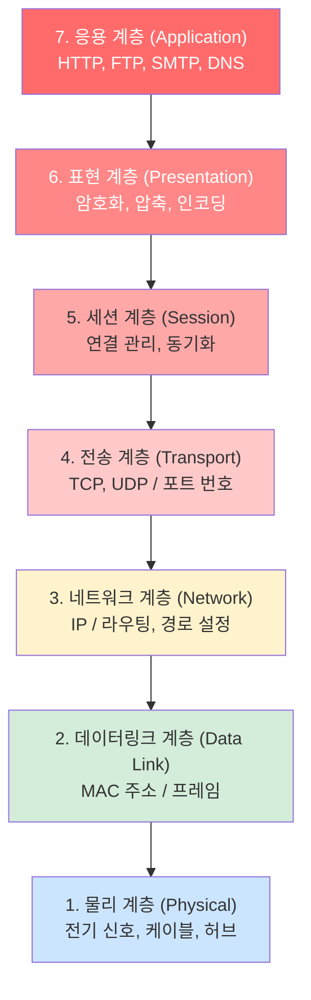

## 2. 각 계층 상세

### 7계층 — 응용 계층 (Application Layer)

사용자와 직접 상호작용하는 계층. 우리가 쓰는 프로토콜이 여기에 속한다.

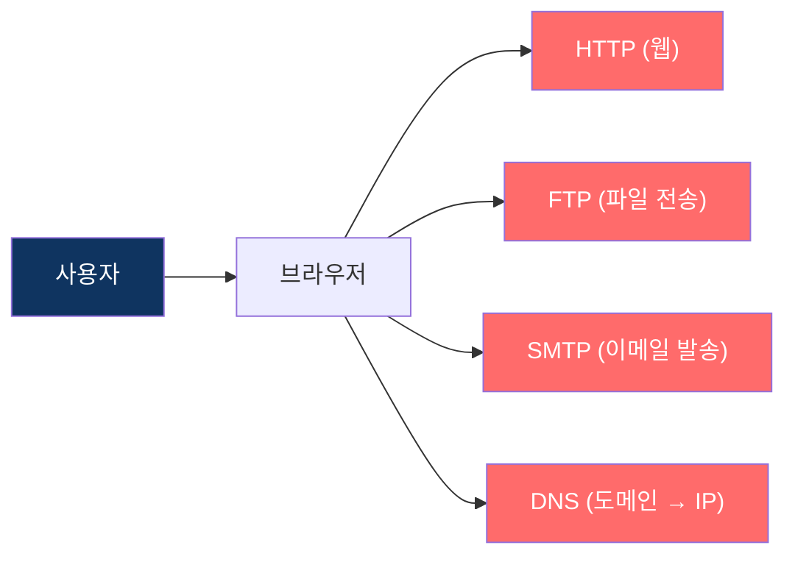

| 프로토콜 | 역할 | 포트 |
|---------|------|------|
| HTTP/HTTPS | 웹 페이지 전송 | 80 / 443 |
| FTP | 파일 전송 | 21 |
| SMTP | 이메일 발송 | 25 |
| DNS | 도메인 → IP 변환 | 53 |
| SSH | 원격 접속 | 22 |

### 6계층 — 표현 계층 (Presentation Layer)

데이터의 **형식을 변환**하는 계층. 암호화, 압축, 인코딩을 담당한다.

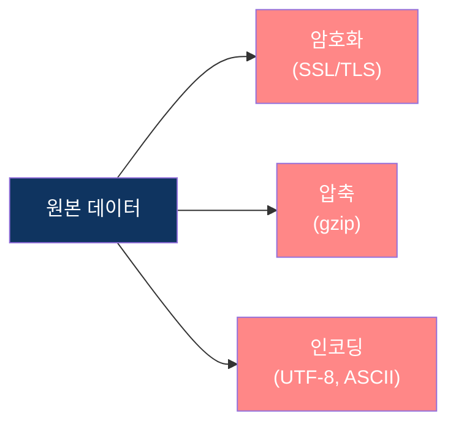

- **암호화/복호화**: HTTPS에서 TLS 암호화
- **압축**: 데이터 크기 줄이기
- **인코딩**: 문자 인코딩 변환 (UTF-8 등)

### 5계층 — 세션 계층 (Session Layer)

통신 세션을 **생성, 관리, 종료**하는 계층.

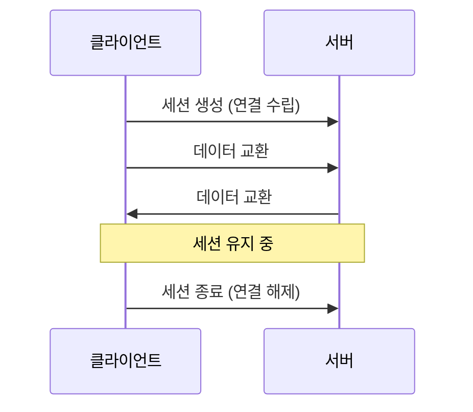

- 통신 양 끝단의 연결을 관리
- 동기화 포인트를 설정하여 데이터 복구 지원
- 전이중(Full-Duplex) / 반이중(Half-Duplex) 통신 관리

### 4계층 — 전송 계층 (Transport Layer) ⭐

**포트 번호**를 사용하여 프로세스 간 통신을 담당. TCP와 UDP가 여기에 속한다.

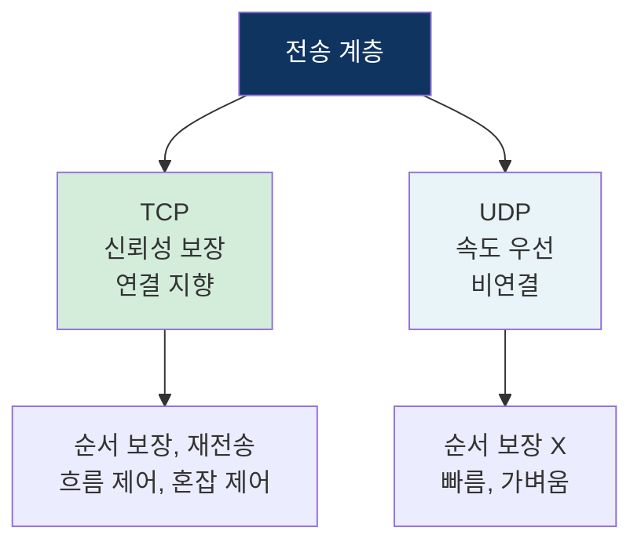

| 구분 | 설명 |
|------|------|
| PDU | 세그먼트 (Segment) |
| 주소 | 포트 번호 (0~65535) |
| 프로토콜 | TCP, UDP |
| 장비 | - |

### 3계층 — 네트워크 계층 (Network Layer) ⭐

**IP 주소**를 사용하여 목적지까지의 **경로(라우팅)** 를 결정하는 계층.

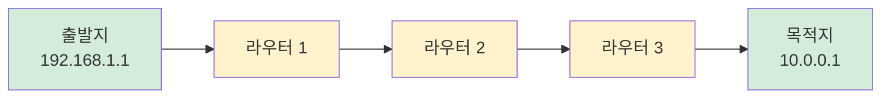

| 구분 | 설명 |
|------|------|
| PDU | 패킷 (Packet) |
| 주소 | IP 주소 |
| 프로토콜 | IP, ICMP, ARP |
| 장비 | 라우터 (Router) |

### 2계층 — 데이터링크 계층 (Data Link Layer)

같은 네트워크 내에서 **MAC 주소**를 사용하여 노드 간 통신을 담당.

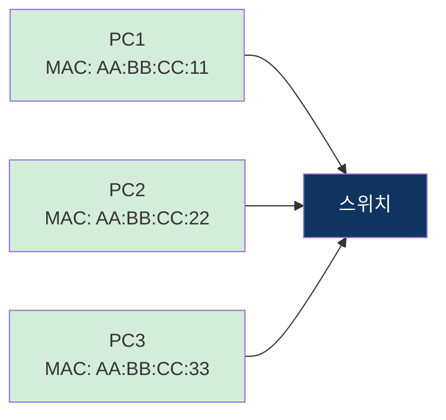

| 구분 | 설명 |
|------|------|
| PDU | 프레임 (Frame) |
| 주소 | MAC 주소 (물리적 주소, 48비트) |
| 장비 | 스위치 (Switch), 브릿지 |
| 역할 | 오류 검출, 흐름 제어, 매체 접근 제어 |

### 1계층 — 물리 계층 (Physical Layer)

실제 **전기 신호**를 전송하는 계층. 0과 1을 전기/광 신호로 변환한다.

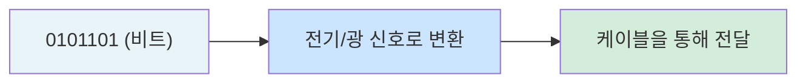

| 구분 | 설명 |
|------|------|
| PDU | 비트 (Bit) |
| 장비 | 허브, 리피터, 케이블 |
| 역할 | 전기 신호 변환, 전송 매체 정의 |

## 3. 데이터 캡슐화 / 역캡슐화

데이터가 송신 측에서 하위 계층으로 내려갈 때마다 **헤더가 추가**(캡슐화)되고, 수신 측에서는 헤더를 하나씩 **제거**(역캡슐화)한다.

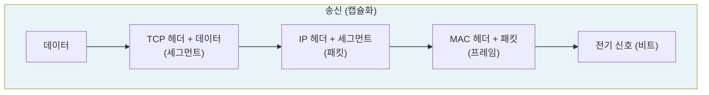

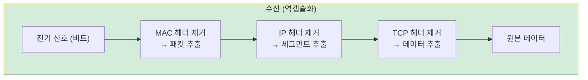

### PDU (Protocol Data Unit) 정리

각 계층에서 처리하는 데이터 단위.

| 계층 | PDU | 추가되는 정보 |
|------|-----|-------------|
| 7~5. 응용/표현/세션 | 데이터 (Data) | - |
| 4. 전송 | 세그먼트 (Segment) | 포트 번호 |
| 3. 네트워크 | 패킷 (Packet) | IP 주소 |
| 2. 데이터링크 | 프레임 (Frame) | MAC 주소 |
| 1. 물리 | 비트 (Bit) | 전기 신호 |

## 4. OSI 7계층 vs TCP/IP 4계층

실제로는 OSI 7계층보다 **TCP/IP 4계층**이 더 많이 사용된다.

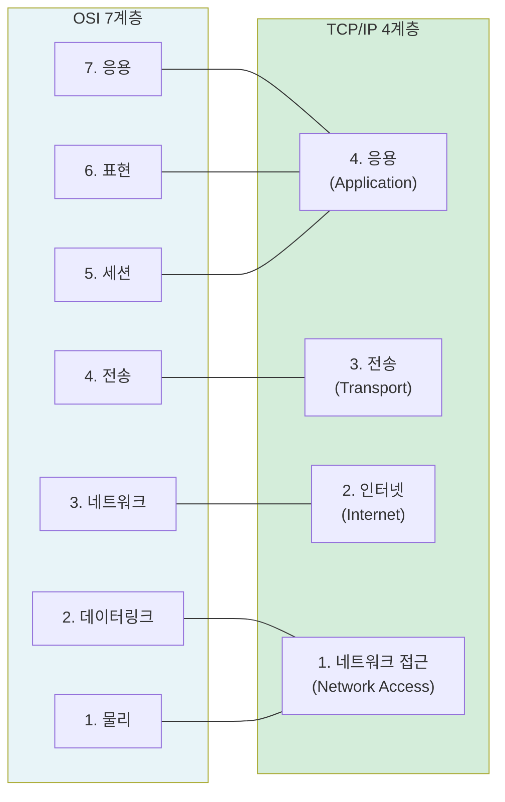

| OSI 7계층 | TCP/IP 4계층 | 프로토콜 예시 |
|----------|-------------|-------------|
| 응용 + 표현 + 세션 | 응용 (Application) | HTTP, DNS, FTP, SSH |
| 전송 | 전송 (Transport) | TCP, UDP |
| 네트워크 | 인터넷 (Internet) | IP, ICMP, ARP |
| 데이터링크 + 물리 | 네트워크 접근 (Network Access) | Ethernet, Wi-Fi |

OSI는 **이론적 표준**, TCP/IP는 **실제 사용되는 모델**이다.

## 5. 전체 통신 흐름 예시

브라우저에서 웹 서버로 요청할 때 각 계층을 거치는 과정.

```mermaid
sequenceDiagram
    participant APP as 7. 응용 (HTTP)
    participant TRANS as 4. 전송 (TCP)
    participant NET as 3. 네트워크 (IP)
    participant LINK as 2. 데이터링크 (Ethernet)
    participant PHY as 1. 물리 (전기 신호)

    Note over APP,PHY: 송신 (캡슐화)
    APP->>TRANS: HTTP 요청 데이터
    TRANS->>NET: + TCP 헤더 (포트 80)
    NET->>LINK: + IP 헤더 (목적지 IP)
    LINK->>PHY: + MAC 헤더 → 프레임
    PHY->>PHY: 전기 신호로 전송

    Note over APP,PHY: 수신 (역캡슐화)
    PHY->>LINK: 전기 신호 → 프레임
    LINK->>NET: MAC 헤더 제거 → 패킷
    NET->>TRANS: IP 헤더 제거 → 세그먼트
    TRANS->>APP: TCP 헤더 제거 → 데이터
```

## 핵심 요약

| 계층 | 이름 | PDU | 주소 | 핵심 역할 | 장비 |
|------|------|-----|------|----------|------|
| 7 | 응용 | 데이터 | - | 사용자 인터페이스 | - |
| 6 | 표현 | 데이터 | - | 암호화, 압축, 인코딩 | - |
| 5 | 세션 | 데이터 | - | 연결 관리 | - |
| 4 | 전송 | 세그먼트 | 포트 번호 | 프로세스 간 통신 | - |
| 3 | 네트워크 | 패킷 | IP 주소 | 경로 설정 (라우팅) | 라우터 |
| 2 | 데이터링크 | 프레임 | MAC 주소 | 노드 간 통신 | 스위치 |
| 1 | 물리 | 비트 | - | 전기 신호 전송 | 허브, 케이블 |
