# TCP & UDP

> 전송 계층(4계층)의 두 핵심 프로토콜. TCP는 신뢰성, UDP는 속도를 우선한다.

## 1. TCP (Transmission Control Protocol)

**연결 지향적**, **신뢰성 있는** 데이터 전송 프로토콜.

### 특징

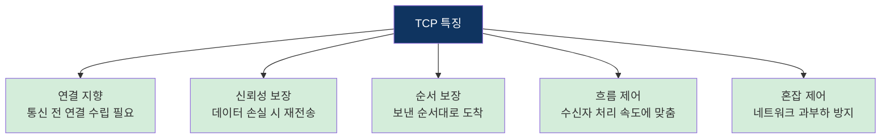

### TCP 세그먼트 구조

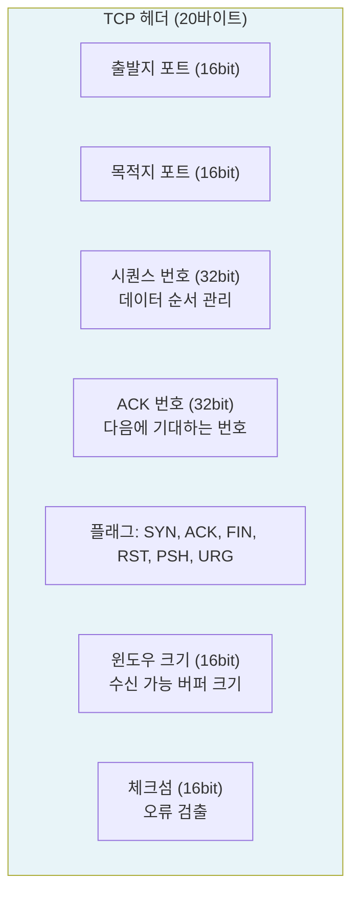

### 주요 플래그

| 플래그 | 의미 | 사용 시점 |
|--------|------|----------|
| **SYN** | 연결 요청 | 연결 수립 시 (3-way handshake) |
| **ACK** | 확인 응답 | 데이터 수신 확인 |
| **FIN** | 연결 종료 | 연결 해제 시 (4-way handshake) |
| **RST** | 연결 강제 초기화 | 비정상 종료 |
| **PSH** | 즉시 전달 | 버퍼링 없이 바로 전달 |
| **URG** | 긴급 데이터 | 우선 처리 필요 |

## 2. TCP 3-Way Handshake (연결 수립) ⭐

TCP 통신을 시작하기 전 **연결을 수립**하는 과정. 3번의 패킷 교환이 필요하다.

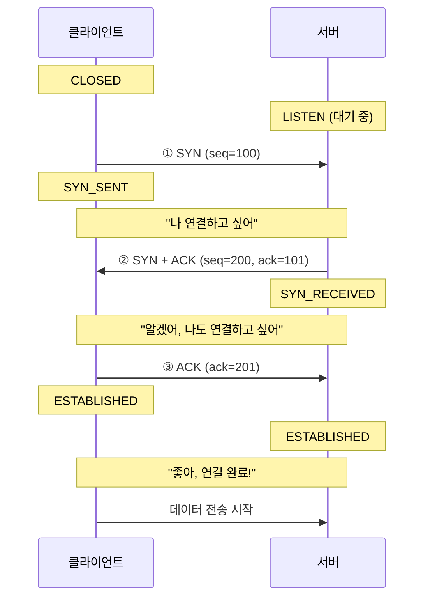

### 각 단계 설명

| 단계 | 방향 | 플래그 | 의미 |
|------|------|--------|------|
| ① | 클라이언트 → 서버 | SYN | 연결 요청 |
| ② | 서버 → 클라이언트 | SYN + ACK | 요청 수락 + 나도 연결 원함 |
| ③ | 클라이언트 → 서버 | ACK | 확인, 연결 수립 완료 |

### 왜 2-way가 아니라 3-way인가?

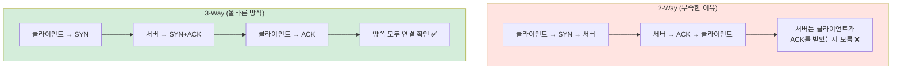

3-way가 필요한 이유는 **양방향 통신 가능**을 확인하기 위해서다. 클라이언트→서버, 서버→클라이언트 양쪽 모두 확인해야 한다.

## 3. TCP 4-Way Handshake (연결 해제) ⭐

TCP 연결을 **종료**하는 과정. 4번의 패킷 교환이 필요하다.

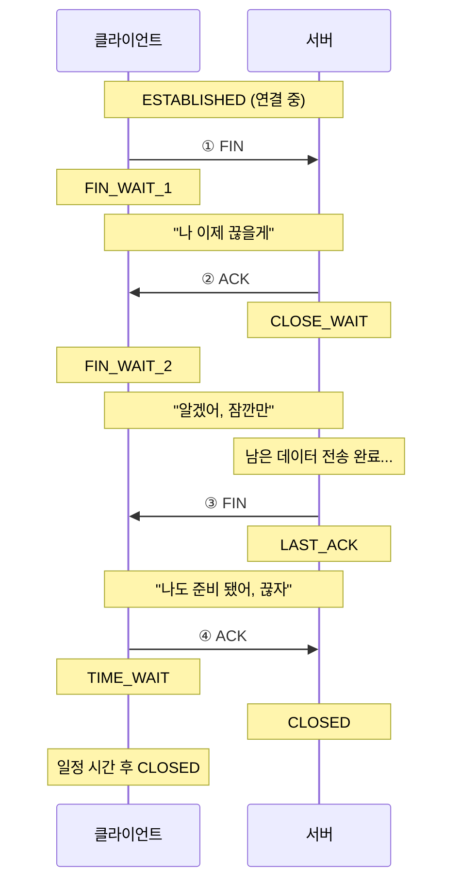

### 왜 4-way인가? (3-way로 안 되는 이유)

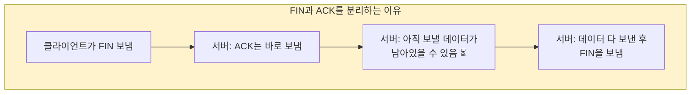

서버가 ACK와 FIN을 동시에 보낼 수 없는 이유는, ACK를 보낸 후에도 **아직 전송할 데이터가 남아있을 수 있기 때문**이다.

### TIME_WAIT 상태

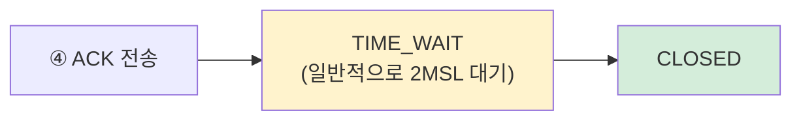

TIME_WAIT가 필요한 이유:
1. **마지막 ACK 유실 대비**: 서버가 ACK를 못 받으면 FIN을 재전송함. 이때 응답하려면 아직 연결이 살아있어야 함
2. **지연 패킷 처리**: 이전 연결의 패킷이 새 연결에 영향을 주지 않도록 대기

## 4. TCP 흐름 제어 (Flow Control)

**수신자의 처리 속도**에 맞춰 송신자의 전송 속도를 조절하는 기법.

### Stop-and-Wait

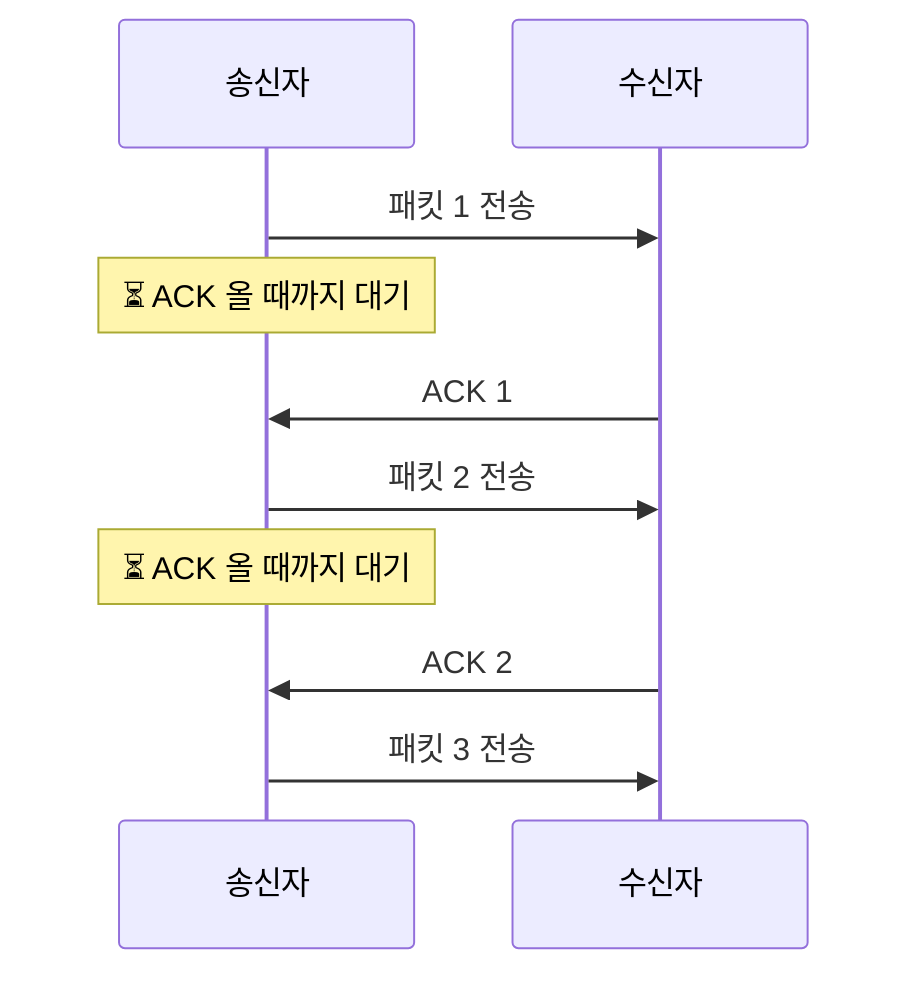

- 한 번에 하나씩 보내고 확인
- 단순하지만 **매우 비효율적** (대기 시간 낭비)

### Sliding Window ⭐

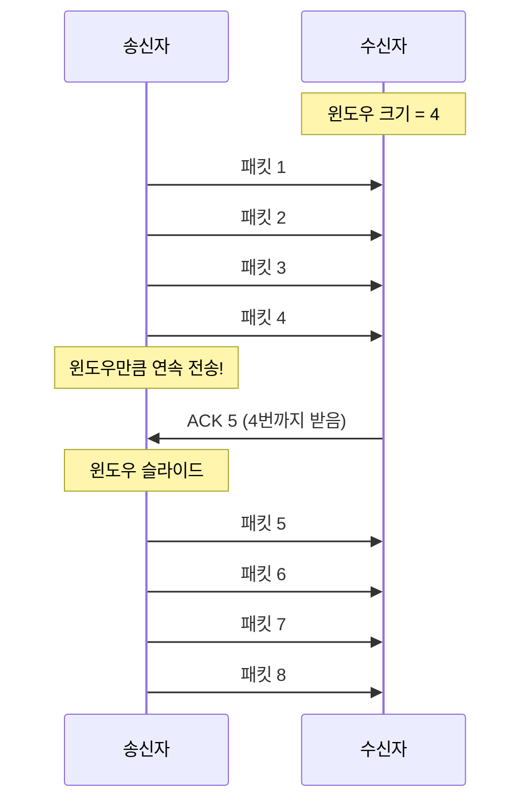

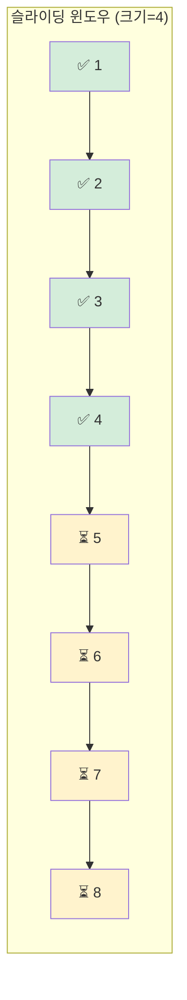

- ACK를 기다리지 않고 **윈도우 크기만큼 연속 전송**
- 수신자가 ACK에 윈도우 크기를 담아 보내면, 송신자가 속도를 조절
- Stop-and-Wait보다 **훨씬 효율적**

## 5. TCP 혼잡 제어 (Congestion Control)

**네트워크 전체의 혼잡 상태**에 따라 전송 속도를 조절하는 기법.

> 흐름 제어 = 수신자 기준 / 혼잡 제어 = 네트워크 기준

### 혼잡 제어 알고리즘

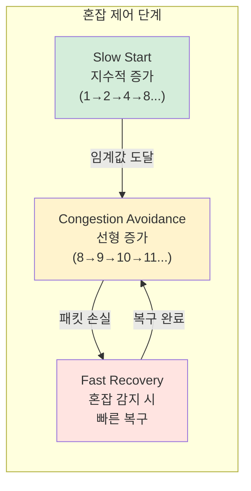

### Slow Start → Congestion Avoidance 과정

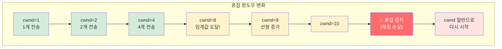

| 단계 | 동작 | 윈도우 변화 |
|------|------|-----------|
| Slow Start | 지수적 증가 (2배씩) | 1→2→4→8→16... |
| Congestion Avoidance | 선형 증가 (+1씩) | 16→17→18→19... |
| 혼잡 감지 | 패킷 손실 발생 | 윈도우 크기 절반으로 축소 |
| Fast Recovery | 빠른 복구 | 절반에서 선형 증가 재시작 |

## 6. UDP (User Datagram Protocol)

**비연결형**, **신뢰성 없는** 데이터 전송 프로토콜. 빠르고 가볍다.

### 특징

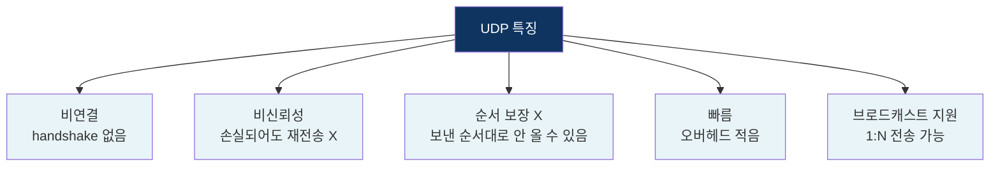

### UDP 데이터그램 구조

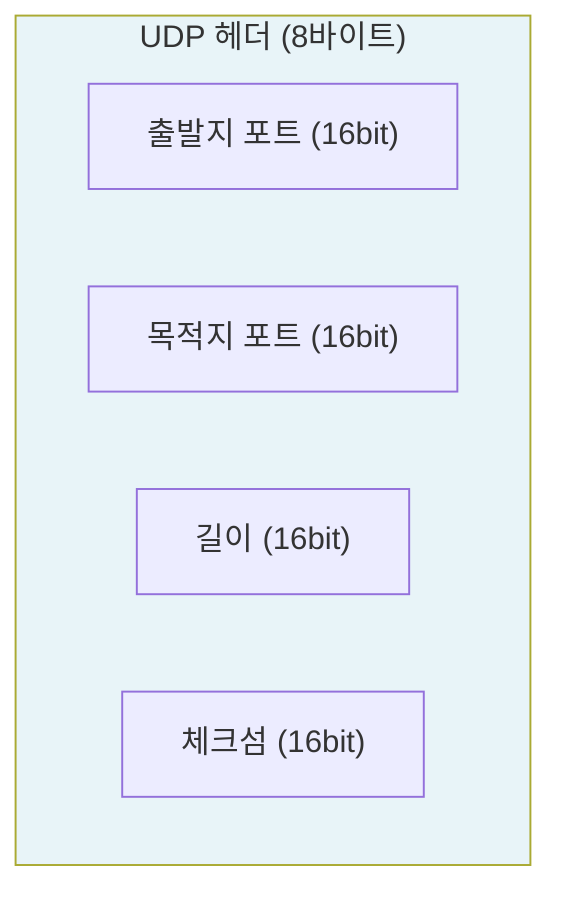

TCP 헤더(20바이트)보다 **훨씬 작다**(8바이트). 연결 관리, 순서, 재전송 같은 기능이 없어서 가볍다.

### UDP 전송 방식

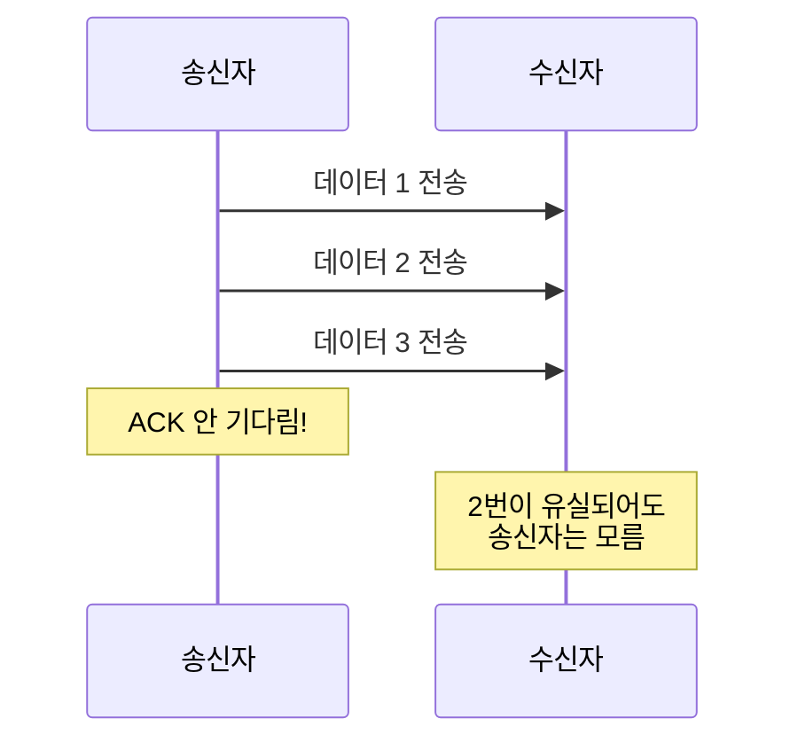

### UDP 사용 사례

| 사용 사례 | 이유 |
|----------|------|
| 실시간 스트리밍 (유튜브, 넷플릭스) | 약간의 손실보다 지연이 더 문제 |
| 온라인 게임 | 실시간성이 중요 |
| VoIP (인터넷 전화) | 지연 최소화 |
| DNS 조회 | 짧은 데이터, 빠른 응답 필요 |
| IoT 센서 데이터 | 가벼운 프로토콜 필요 |

## 7. TCP vs UDP 비교 ⭐

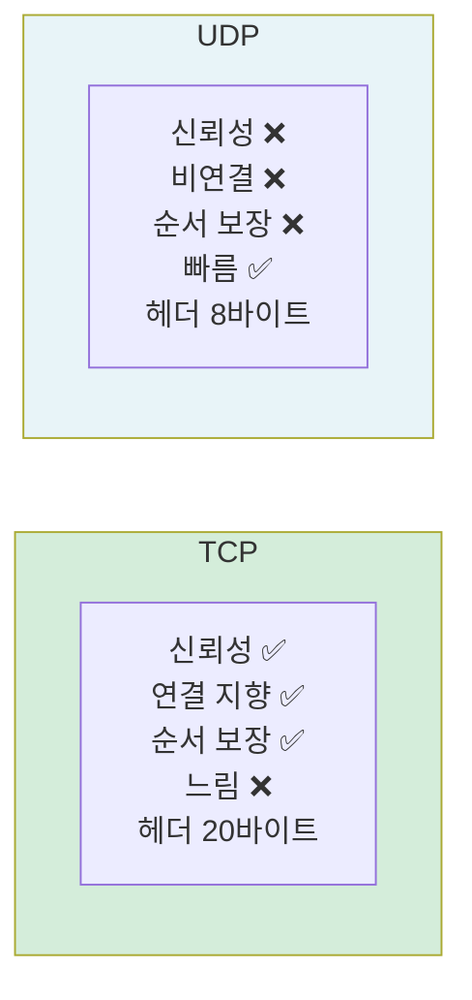

| 구분 | TCP | UDP |
|------|-----|-----|
| 연결 | 연결 지향 (3-way handshake) | 비연결 |
| 신뢰성 | 보장 (재전송) | 미보장 |
| 순서 | 보장 | 미보장 |
| 속도 | 상대적으로 느림 | 빠름 |
| 헤더 크기 | 20바이트 | 8바이트 |
| 흐름 제어 | 있음 | 없음 |
| 혼잡 제어 | 있음 | 없음 |
| 전송 방식 | 1:1 (유니캐스트) | 1:1, 1:N, N:N |
| 사용 예 | HTTP, 이메일, 파일 전송 | 스트리밍, DNS, 게임 |

### 비유

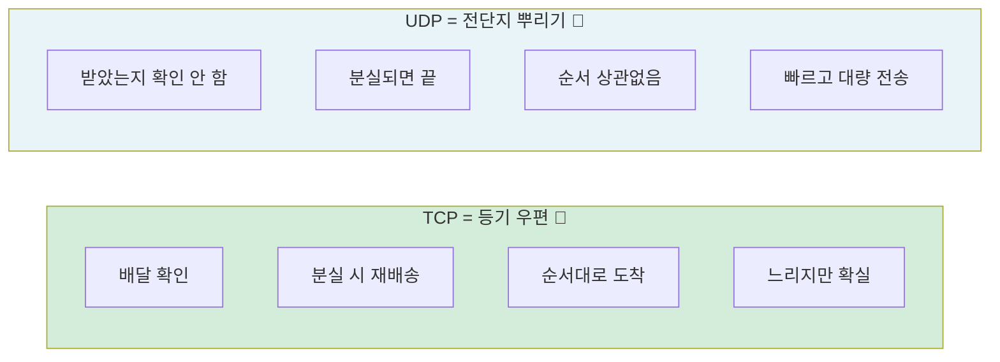

## 8. TCP 상태 다이어그램

TCP 연결의 전체 상태 전이.

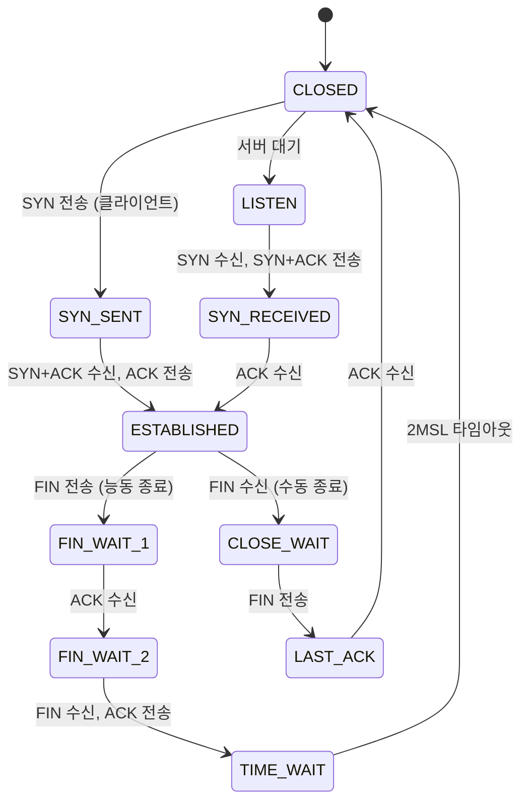

## 핵심 요약

| 개념 | 핵심 |
|------|------|
| TCP | 신뢰성, 연결 지향, 순서 보장 |
| 3-Way Handshake | SYN → SYN+ACK → ACK (연결 수립) |
| 4-Way Handshake | FIN → ACK → FIN → ACK (연결 해제) |
| 흐름 제어 | 수신자 속도에 맞춤 (Sliding Window) |
| 혼잡 제어 | 네트워크 혼잡에 맞춤 (Slow Start) |
| UDP | 빠름, 비연결, 비신뢰성 |
| TCP vs UDP | 신뢰성 vs 속도 트레이드오프 |
