# HTTP (HyperText Transfer Protocol)

> 웹에서 클라이언트와 서버가 통신하는 프로토콜. 요청-응답 구조로 동작한다.

## 1. HTTP란?

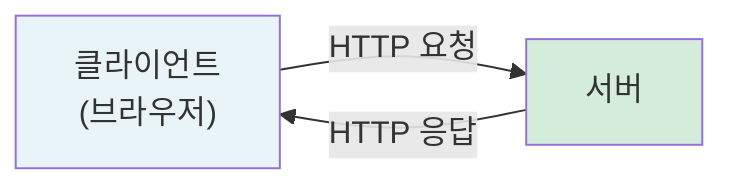

### HTTP 특징

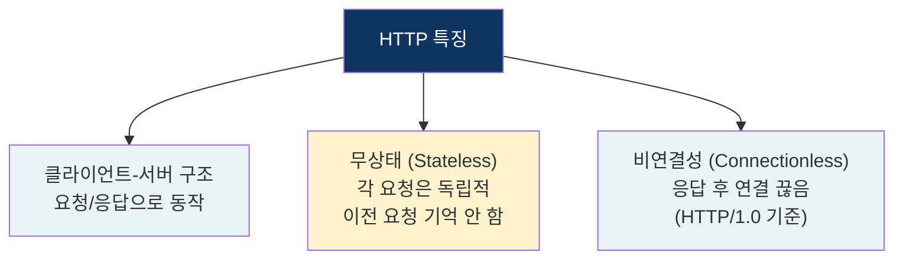

### Stateless (무상태)

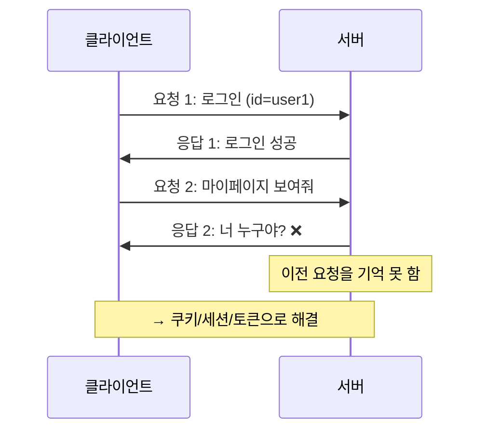

서버가 클라이언트의 상태를 저장하지 않으므로, 매 요청마다 필요한 정보를 모두 포함해야 한다.

## 2. HTTP 요청/응답 구조

### HTTP 요청 (Request)

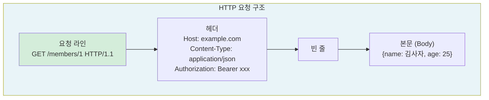

### HTTP 응답 (Response)

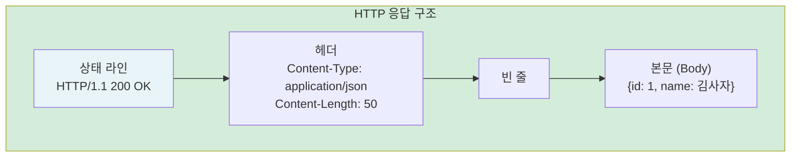

## 3. HTTP 메서드 ⭐

클라이언트가 서버에게 **어떤 동작**을 원하는지 나타내는 방법.

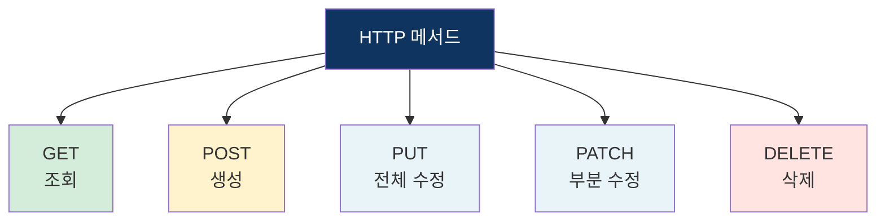

| 메서드 | 역할 | 요청 Body | 멱등성 | 안전성 |
|--------|------|-----------|--------|--------|
| **GET** | 리소스 조회 | 없음 | ✅ | ✅ |
| **POST** | 리소스 생성 | 있음 | ❌ | ❌ |
| **PUT** | 리소스 전체 수정 | 있음 | ✅ | ❌ |
| **PATCH** | 리소스 부분 수정 | 있음 | ❌ | ❌ |
| **DELETE** | 리소스 삭제 | 없음 | ✅ | ❌ |

### 멱등성 (Idempotent)

같은 요청을 여러 번 보내도 **결과가 동일**한 성질.

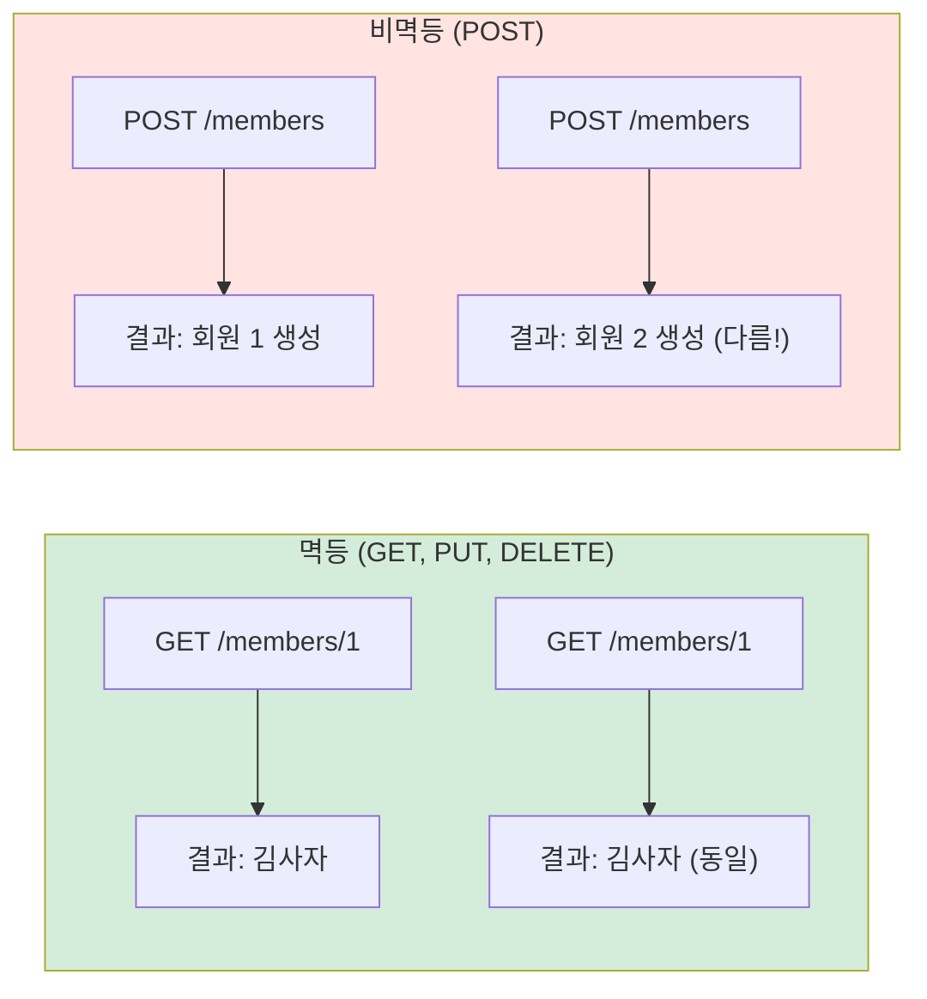

### 안전성 (Safe)

서버의 **상태를 변경하지 않는** 메서드. GET, HEAD, OPTIONS만 안전하다.

## 4. HTTP 상태 코드 ⭐

서버가 요청을 어떻게 처리했는지 알려주는 3자리 숫자.

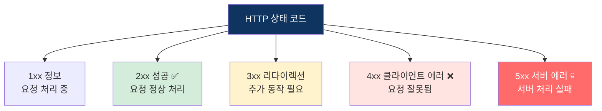

### 자주 쓰이는 상태 코드

| 코드 | 이름 | 설명 |
|------|------|------|
| **200** | OK | 요청 성공 |
| **201** | Created | 리소스 생성 성공 |
| **204** | No Content | 성공, 응답 본문 없음 |
| **301** | Moved Permanently | 영구 이동 (URL 변경) |
| **302** | Found | 임시 이동 |
| **304** | Not Modified | 캐시 사용 (수정 없음) |
| **400** | Bad Request | 잘못된 요청 (문법 오류 등) |
| **401** | Unauthorized | 인증 필요 (로그인 안 됨) |
| **403** | Forbidden | 권한 없음 (인가 실패) |
| **404** | Not Found | 리소스 없음 |
| **405** | Method Not Allowed | 허용되지 않는 메서드 |
| **500** | Internal Server Error | 서버 내부 오류 |
| **502** | Bad Gateway | 게이트웨이 오류 |
| **503** | Service Unavailable | 서비스 이용 불가 |

### 401 vs 403 차이

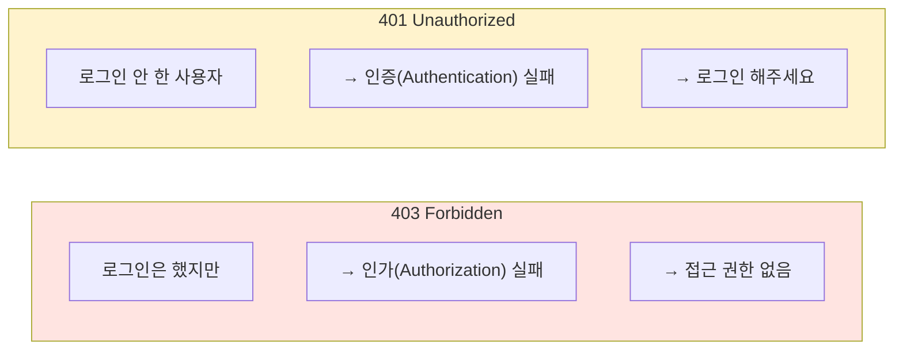

## 5. HTTP 헤더

요청/응답에 **부가 정보**를 담는 영역.

### 주요 요청 헤더

| 헤더 | 설명 | 예시 |
|------|------|------|
| Host | 요청 대상 서버 | `Host: www.example.com` |
| Content-Type | 본문 데이터 타입 | `Content-Type: application/json` |
| Accept | 원하는 응답 데이터 타입 | `Accept: application/json` |
| Authorization | 인증 정보 | `Authorization: Bearer {token}` |
| Cookie | 쿠키 전송 | `Cookie: sessionId=abc123` |
| User-Agent | 클라이언트 정보 | `User-Agent: Mozilla/5.0...` |

### 주요 응답 헤더

| 헤더 | 설명 | 예시 |
|------|------|------|
| Content-Type | 응답 데이터 타입 | `Content-Type: application/json` |
| Content-Length | 응답 본문 크기 | `Content-Length: 1024` |
| Set-Cookie | 쿠키 설정 | `Set-Cookie: sessionId=abc123` |
| Location | 리다이렉트 위치 | `Location: /new-page` |
| Cache-Control | 캐시 정책 | `Cache-Control: max-age=3600` |

## 6. 쿠키와 세션

HTTP는 Stateless라서 상태를 기억하지 못한다. 이를 보완하기 위해 쿠키와 세션을 사용한다.

### 쿠키 (Cookie)

**클라이언트(브라우저)** 에 저장되는 작은 데이터.

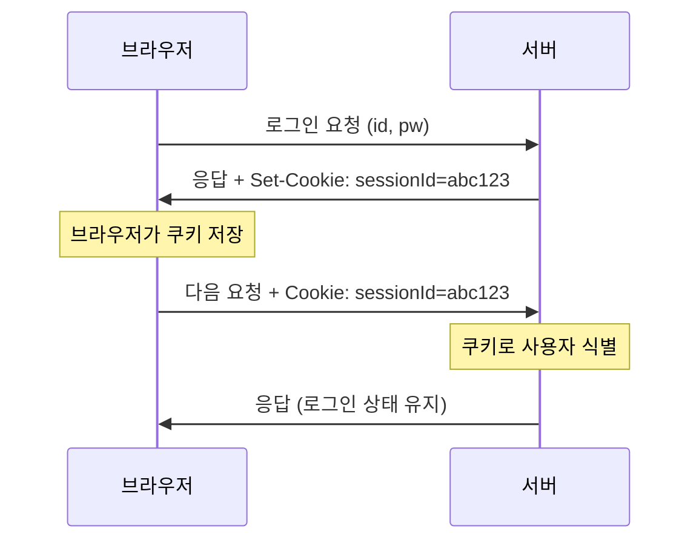

### 세션 (Session)

**서버** 에 저장되는 사용자 상태 정보. 세션 ID만 쿠키로 주고받는다.

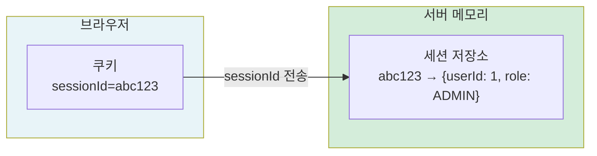

### 쿠키 vs 세션

| 구분 | 쿠키 | 세션 |
|------|------|------|
| 저장 위치 | 클라이언트 (브라우저) | 서버 |
| 보안 | 상대적으로 취약 (변조 가능) | 안전 (서버에 저장) |
| 용량 | 4KB 제한 | 제한 없음 (서버 메모리) |
| 속도 | 빠름 (로컬 저장) | 상대적으로 느림 (서버 조회) |
| 만료 | 설정 가능 (Expires) | 서버 설정에 따름 |

## 7. HTTP 버전별 차이 ⭐

### HTTP/1.0

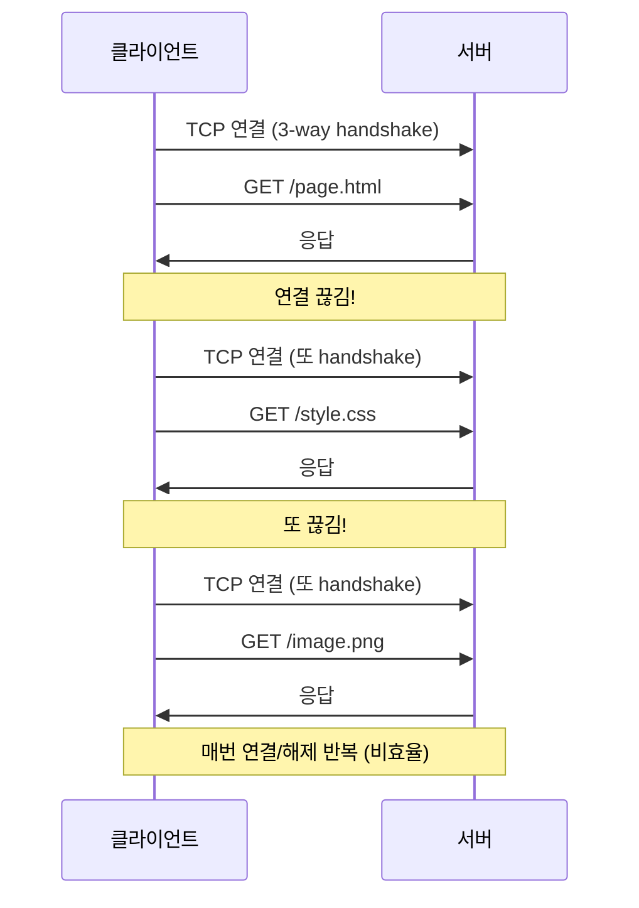

### HTTP/1.1 — Keep-Alive ⭐

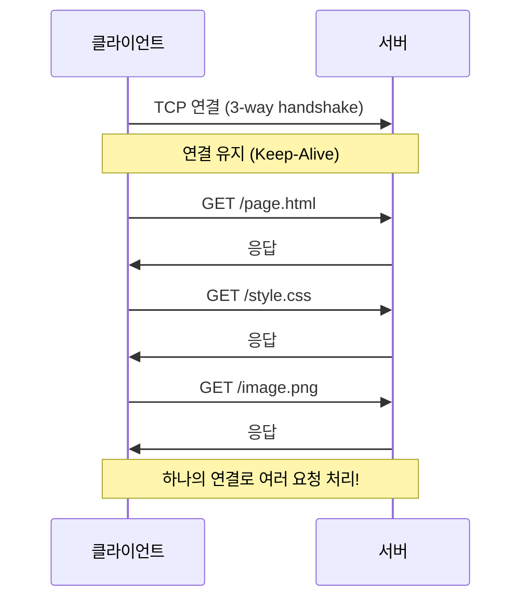

하지만 HTTP/1.1에는 **HOL Blocking (Head-of-Line Blocking)** 문제가 있다.

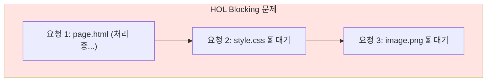

앞선 요청이 느리면 뒤의 요청이 모두 **대기**해야 한다.

### HTTP/2 — 멀티플렉싱 ⭐

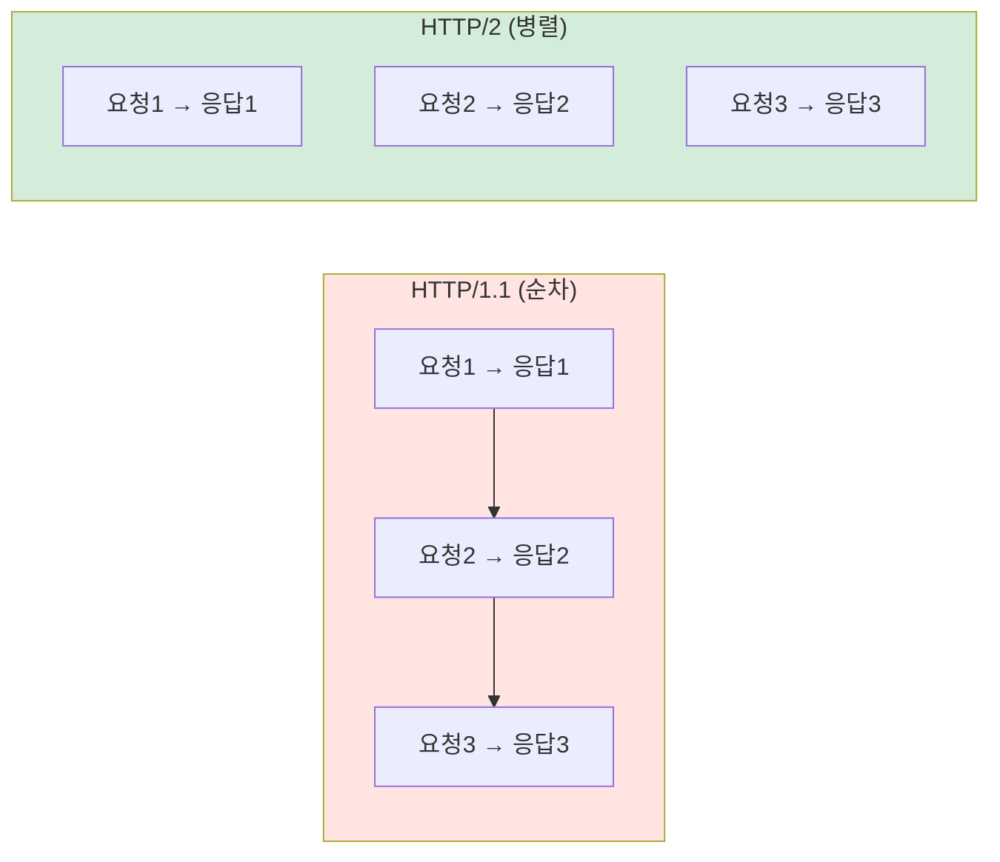

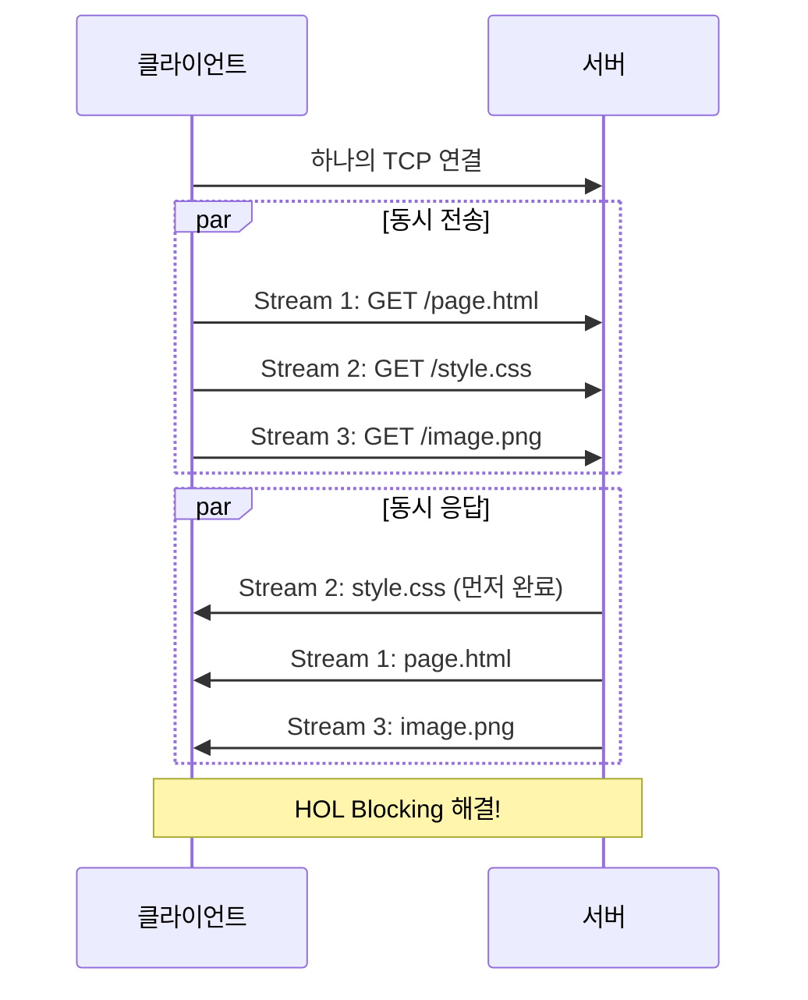

HTTP/2 주요 특징:
- **멀티플렉싱**: 하나의 연결에서 여러 요청/응답 동시 처리
- **헤더 압축**: HPACK 방식으로 헤더 크기 축소
- **서버 푸시**: 클라이언트가 요청하지 않은 리소스를 미리 전송
- **바이너리 프레이밍**: 텍스트가 아닌 바이너리로 전송 (파싱 효율 증가)

### HTTP/3 — QUIC (UDP 기반)

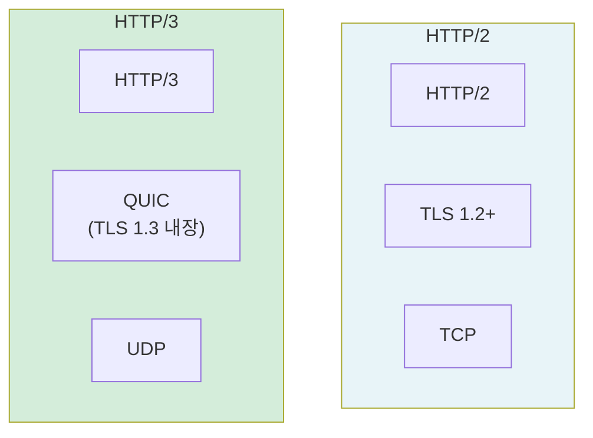

| 구분 | HTTP/2 | HTTP/3 |
|------|--------|--------|
| 전송 계층 | TCP | **UDP (QUIC)** |
| 연결 수립 | TCP handshake + TLS handshake | **QUIC handshake (1-RTT)** |
| HOL Blocking | TCP 레벨에서 여전히 존재 | **완전 해결** (스트림 독립) |
| 연결 마이그레이션 | IP 바뀌면 재연결 | **Connection ID로 유지** |

HTTP/3가 UDP를 쓰는 이유: TCP는 프로토콜 자체를 수정할 수 없지만(OS 커널에 내장), UDP 위에 **QUIC**이라는 새 프로토콜을 올려서 TCP의 장점(신뢰성)을 구현하면서 단점(HOL Blocking)은 해결할 수 있다.

### 버전 비교 요약

| 버전 | 핵심 특징 | 한계 |
|------|----------|------|
| HTTP/1.0 | 요청마다 연결/해제 | 매번 handshake (느림) |
| HTTP/1.1 | Keep-Alive (연결 유지) | HOL Blocking |
| HTTP/2 | 멀티플렉싱, 헤더 압축 | TCP 레벨 HOL Blocking |
| HTTP/3 | QUIC(UDP 기반), 1-RTT | 아직 보급 진행 중 |

## 핵심 요약

| 개념 | 핵심 |
|------|------|
| HTTP 특징 | Stateless, 요청-응답 구조 |
| 메서드 | GET(조회), POST(생성), PUT(전체수정), PATCH(부분수정), DELETE(삭제) |
| 멱등성 | 같은 요청 여러 번 = 같은 결과 (GET, PUT, DELETE) |
| 상태 코드 | 2xx 성공, 3xx 리다이렉션, 4xx 클라이언트 에러, 5xx 서버 에러 |
| 쿠키/세션 | Stateless 보완 (쿠키=클라이언트, 세션=서버) |
| HTTP/1.1 | Keep-Alive, HOL Blocking 문제 |
| HTTP/2 | 멀티플렉싱으로 HOL Blocking 해결 |
| HTTP/3 | QUIC(UDP 기반), 연결 수립 1-RTT |
