# HTTPS & DNS

> HTTPS는 HTTP에 보안(TLS)을 더한 프로토콜, DNS는 도메인을 IP로 변환하는 시스템.

## 1. 대칭키 & 공개키 (비대칭키)

HTTPS를 이해하려면 먼저 암호화 방식을 알아야 한다.

### 대칭키 암호화

**하나의 키**로 암호화와 복호화를 모두 수행.

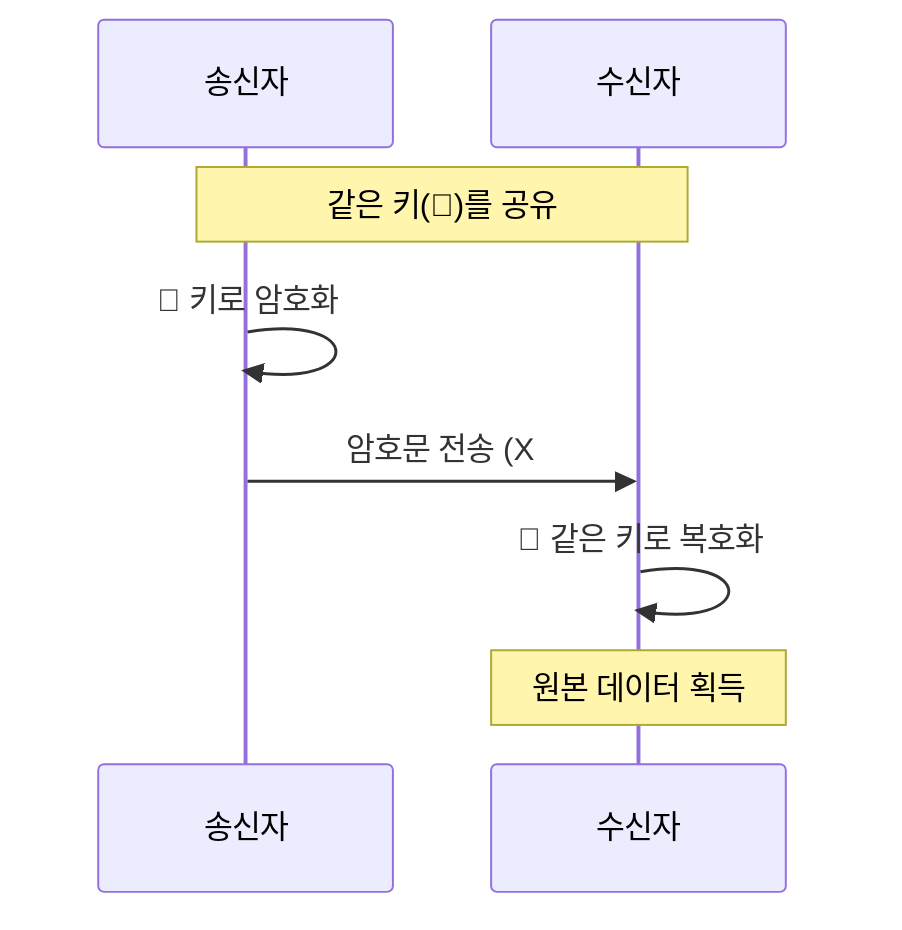

| 장점 | 단점 |
|------|------|
| 암복호화 속도 빠름 | 키를 어떻게 안전하게 전달하나? (키 배송 문제) |
| 구현 간단 | 통신 상대마다 다른 키 필요 |

대표 알고리즘: AES, DES, 3DES

### 공개키 (비대칭키) 암호화

**공개키**와 **개인키**, 2개의 키를 사용. 공개키로 암호화하면 개인키로만 복호화 가능.

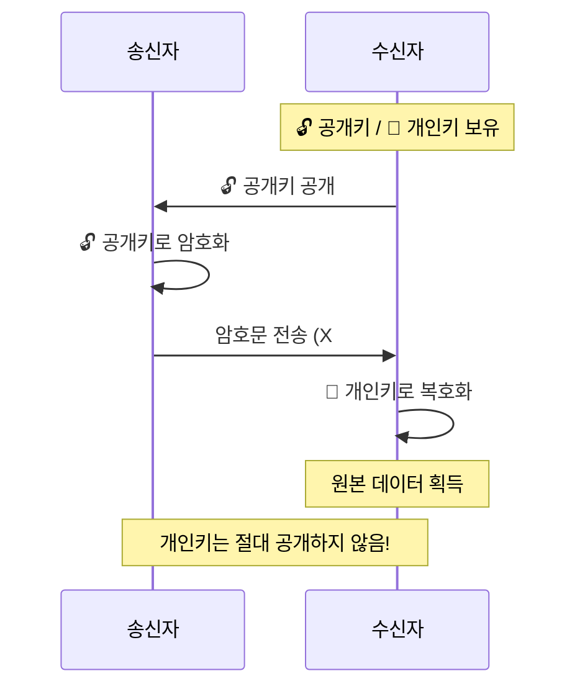

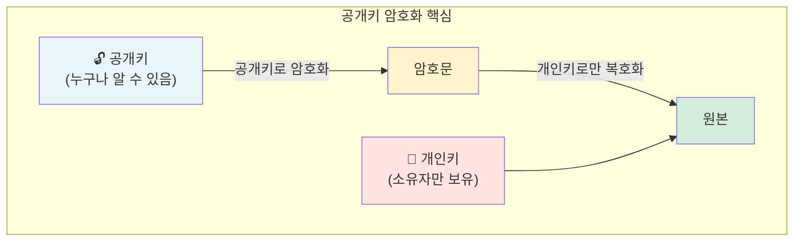

| 장점 | 단점 |
|------|------|
| 키 배송 문제 해결 | 속도 느림 (대칭키 대비) |
| 디지털 서명 가능 | 연산 비용 높음 |

대표 알고리즘: RSA, ECDSA

### 하이브리드 방식 (실제 HTTPS)

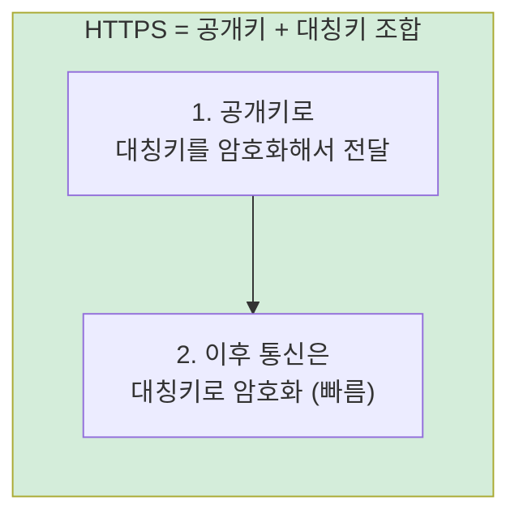

공개키 방식으로 **대칭키를 안전하게 교환**한 뒤, 이후 통신은 **빠른 대칭키 방식**으로 하는 것. 두 방식의 장점만 취한다.

## 2. HTTPS란?

**HTTP + TLS(SSL)** = HTTPS. HTTP 통신을 암호화하여 데이터를 보호한다.

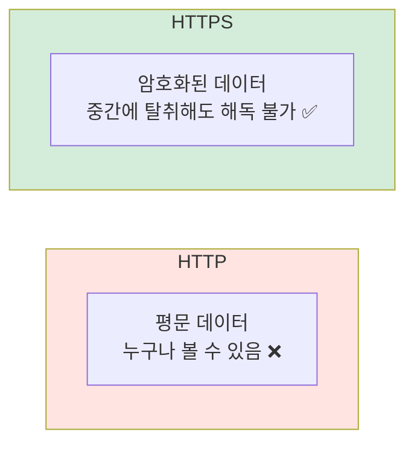

### HTTPS가 보호하는 것

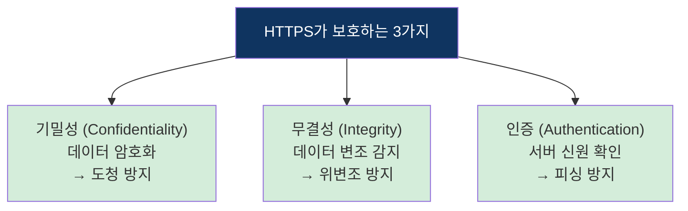

## 3. SSL/TLS 인증서

서버가 "나는 진짜 이 도메인의 주인이다"를 증명하는 **디지털 인증서**.

### 인증서 발급 과정

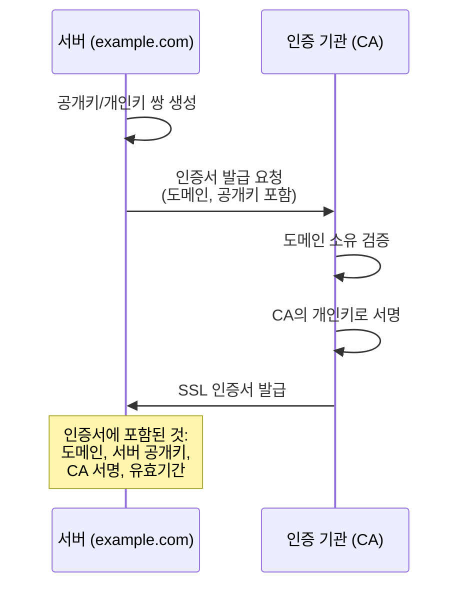

### 인증서 신뢰 체인

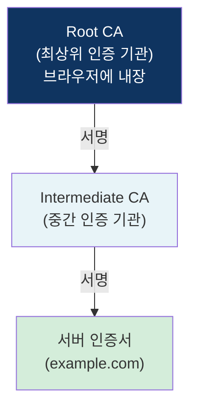

브라우저는 Root CA 목록을 내장하고 있어서, 인증서 체인을 따라 올라가며 신뢰 여부를 확인한다.

## 4. TLS Handshake ⭐

HTTPS 연결 시 클라이언트와 서버가 **암호화 방식을 합의**하고 **대칭키를 교환**하는 과정.

### TLS 1.2 Handshake

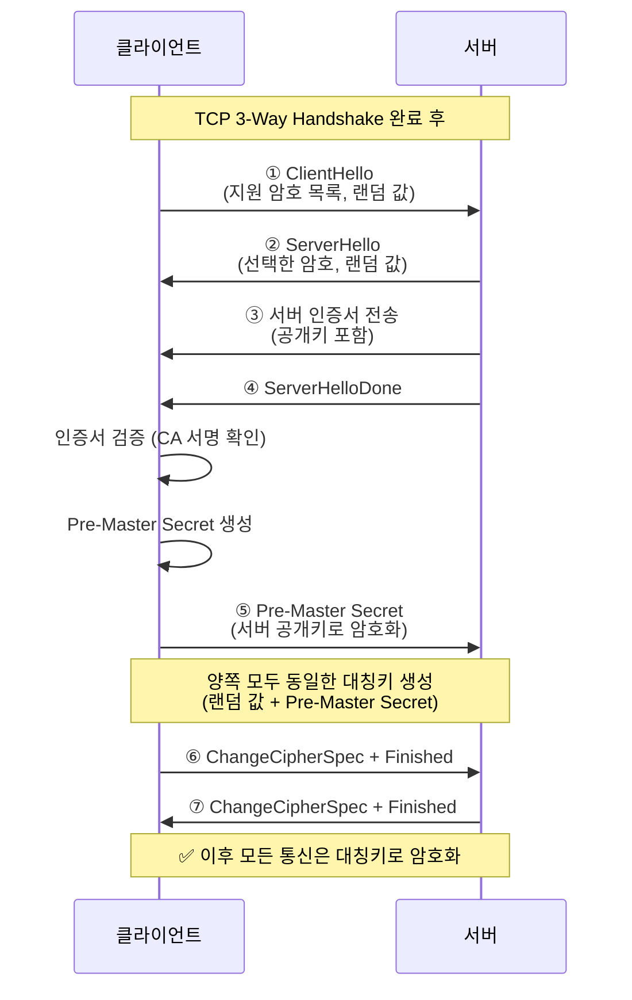

### TLS 1.3 Handshake (개선)

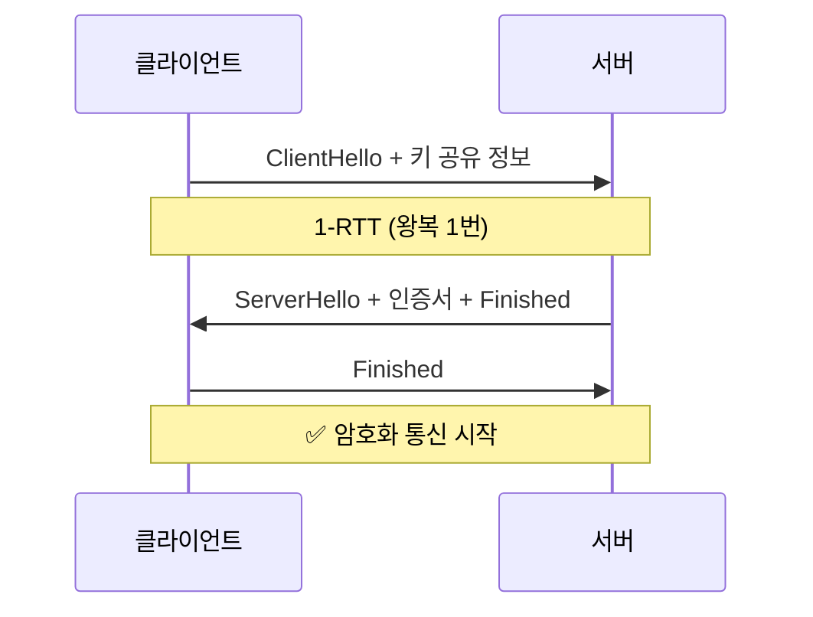

### TLS 1.2 vs 1.3

| 구분 | TLS 1.2 | TLS 1.3 |
|------|---------|---------|
| Handshake | 2-RTT | **1-RTT** |
| 0-RTT 재연결 | 미지원 | **지원** |
| 암호 스위트 | 다양 (일부 취약) | 안전한 것만 허용 |
| 성능 | 상대적 느림 | 빠름 |

### 전체 HTTPS 연결 과정

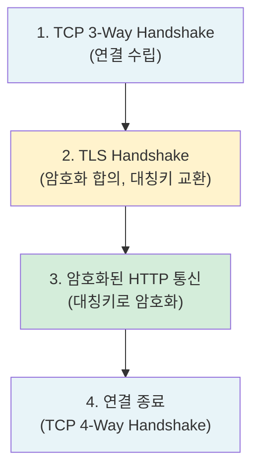

## 5. HTTP vs HTTPS

| 구분 | HTTP | HTTPS |
|------|------|-------|
| 포트 | 80 | 443 |
| 암호화 | 없음 (평문) | TLS 암호화 |
| 인증서 | 불필요 | SSL 인증서 필요 |
| 속도 | 빠름 | 약간 느림 (handshake 비용) |
| URL | `http://` | `https://` |
| 보안 | 도청/변조 가능 | 도청/변조 불가 |

## 6. DNS (Domain Name System) ⭐

도메인 이름을 **IP 주소**로 변환하는 시스템. 인터넷의 전화번호부.

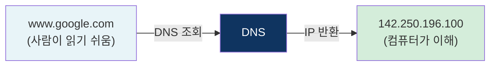

### 도메인 구조

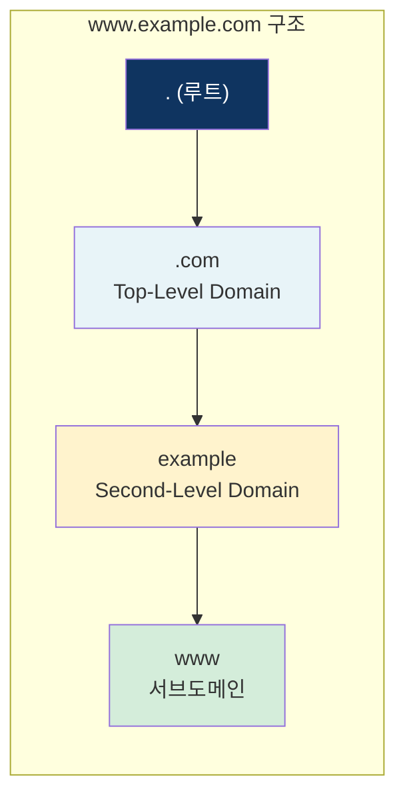

도메인은 오른쪽에서 왼쪽으로 읽는다: `. → com → example → www`

### DNS 서버 종류

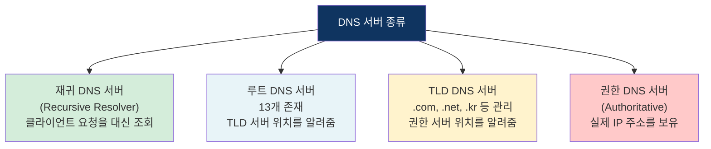

## 7. DNS 조회 과정 ⭐

브라우저에 `www.example.com`을 입력했을 때 IP를 찾는 전체 과정.

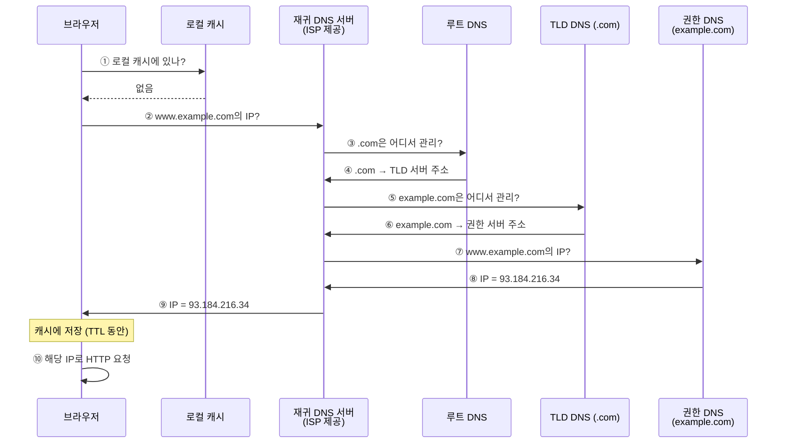

### DNS 캐싱

매번 이 과정을 거치면 느리니까, 여러 단계에서 **캐싱**을 한다.

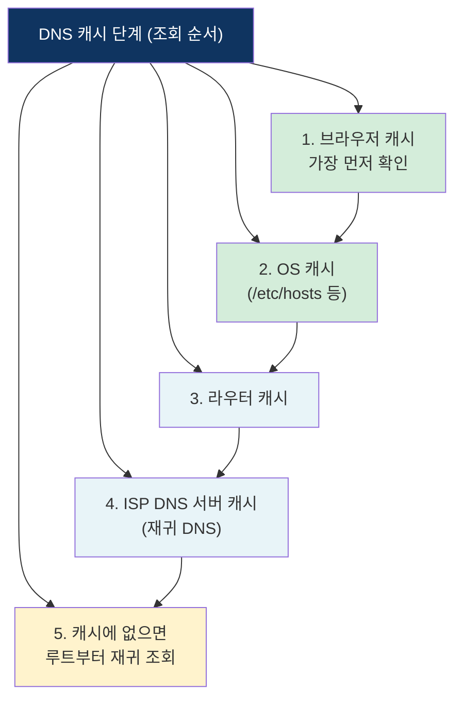

각 캐시에는 **TTL(Time To Live)** 이 설정되어 있어서, 일정 시간이 지나면 캐시가 만료되고 다시 조회한다.

### DNS 레코드 타입

| 타입 | 설명 | 예시 |
|------|------|------|
| **A** | 도메인 → IPv4 주소 | example.com → 93.184.216.34 |
| **AAAA** | 도메인 → IPv6 주소 | example.com → 2606:2800:... |
| **CNAME** | 도메인 → 다른 도메인 (별칭) | www.example.com → example.com |
| **MX** | 메일 서버 지정 | example.com → mail.example.com |
| **NS** | 네임서버 지정 | example.com → ns1.example.com |
| **TXT** | 텍스트 정보 | SPF, DKIM 등 인증용 |

## 8. 브라우저에 URL을 입력하면? (전체 흐름)

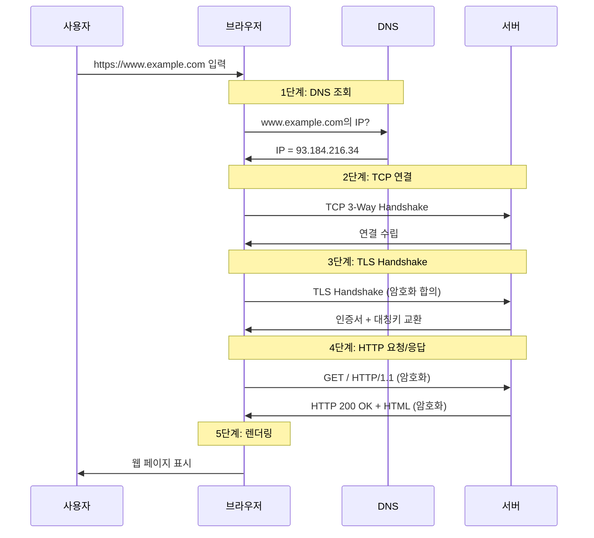

## 핵심 요약

| 개념 | 핵심 |
|------|------|
| 대칭키 | 하나의 키로 암복호화, 빠르지만 키 배송 문제 |
| 공개키 | 공개키/개인키 쌍, 느리지만 키 배송 문제 해결 |
| HTTPS | HTTP + TLS, 공개키로 대칭키 교환 후 대칭키로 통신 |
| TLS Handshake | 암호화 합의 + 대칭키 교환 과정 |
| 인증서 | CA가 서명한 서버 신원 증명서 |
| DNS | 도메인 → IP 변환 시스템 |
| DNS 조회 | 캐시 → 재귀 서버 → 루트 → TLD → 권한 서버 |
| 전체 흐름 | DNS 조회 → TCP → TLS → HTTP → 렌더링 |
