# CPU (Central Processing Unit)

> CPU는 컴퓨터의 두뇌로, 모든 연산과 명령어 실행을 담당한다.

## 1. CPU 기본 구조

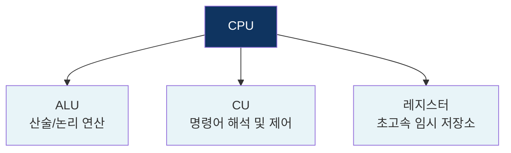

- **ALU**: 덧셈, 뺄셈, AND, OR 같은 실제 연산 수행
- **CU**: 메모리에서 명령어를 가져와서 해석하고 ALU에게 시킴
- **레지스터**: CPU 안에 있는 가장 빠른 저장소, 연산 중인 데이터를 임시 저장

### 예시 - `int a = 1 + 2;` 실행 과정

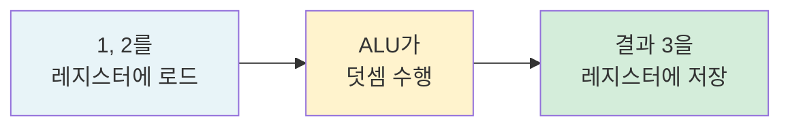

## 2. 명령어 사이클 (Instruction Cycle)

CPU가 명령어를 처리하는 과정은 정해진 사이클로 반복된다.

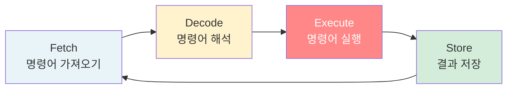

| 단계 | 담당 | 설명 |
|------|------|------|
| Fetch | CU | 메모리에서 명령어를 가져옴 |
| Decode | CU | 명령어를 해석해서 무엇을 할지 판단 |
| Execute | ALU | 실제 연산 수행 |
| Store | CU | 결과를 레지스터/메모리에 저장 |

### 파이프라이닝 (Pipelining)

명령어를 한 줄로 세우지 않고, 공장 컨베이어 벨트처럼 겹쳐서 처리하는 기법.

```mermaid
gantt
    title CPU 파이프라이닝
    dateFormat X
    axisFormat %s

    section 명령어 1
    Fetch   :a1, 0, 1
    Decode  :a2, 1, 2
    Execute :a3, 2, 3
    Store   :a4, 3, 4

    section 명령어 2
    Fetch   :b1, 1, 2
    Decode  :b2, 2, 3
    Execute :b3, 3, 4
    Store   :b4, 4, 5

    section 명령어 3
    Fetch   :c1, 2, 3
    Decode  :c2, 3, 4
    Execute :c3, 4, 5
    Store   :c4, 5, 6
```

파이프라이닝 없이 순차 처리하면 명령어 3개에 12사이클이 걸리지만, 파이프라이닝으로 6사이클에 완료 가능.

## 3. 클럭 속도 / 코어 / 스레드

### 클럭 속도
CPU가 1초에 몇 번 연산하는지를 나타낸다.

- `3.0 GHz` = 1초에 30억 번 연산 가능
- 클럭이 높을수록 빠르지만 발열도 심해진다

### 코어 (Core)
CPU 안의 독립적인 연산 장치. 코어가 많을수록 동시에 여러 작업 가능.

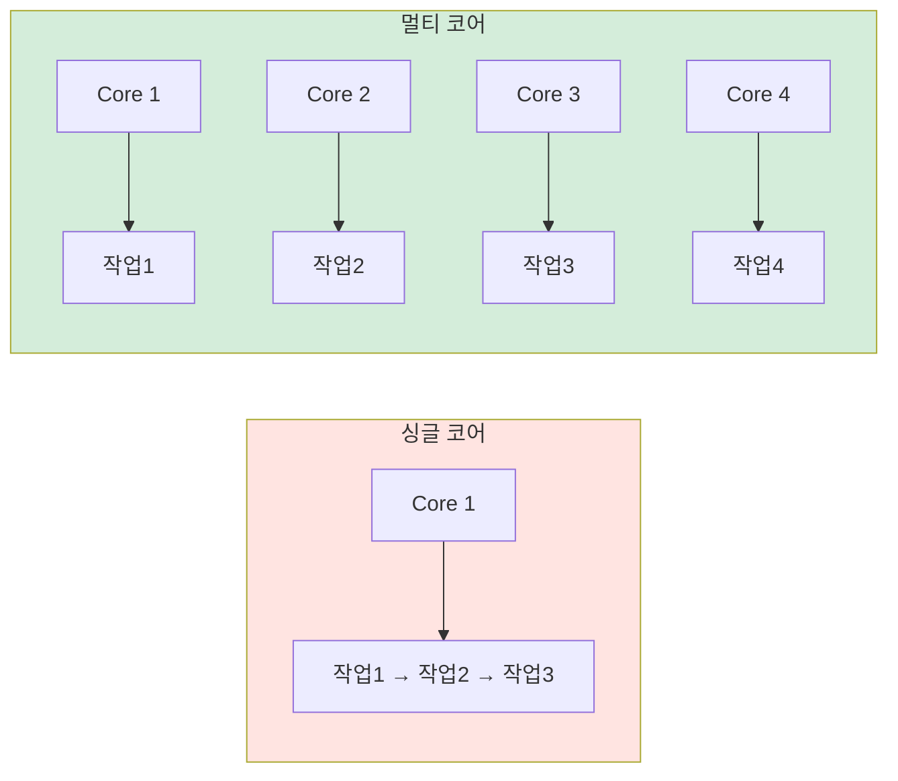

### 하드웨어 스레드 (HyperThreading)
코어 1개가 스레드 2개처럼 동작하는 기술.

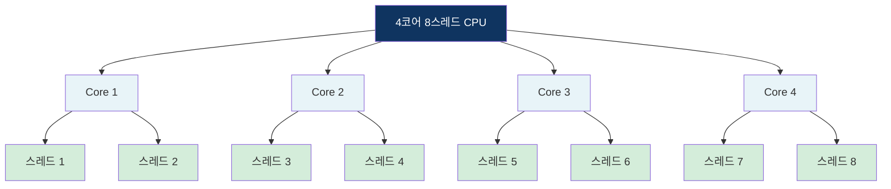

물리적으로는 4개 코어이지만, OS 입장에서는 8개 코어처럼 보인다.

## 4. CPU 스케줄링

CPU는 1개인데 실행할 프로세스는 여러 개다. 누구에게 CPU를 줄지 결정하는 것이 스케줄링.

### 프로세스 상태 다이어그램

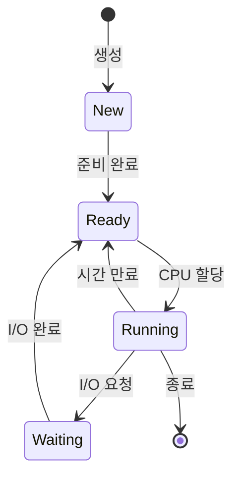

### FCFS (First Come First Served)

```mermaid
gantt
    title FCFS 스케줄링
    dateFormat X
    axisFormat %s

    section CPU
    P1 - 실행시간 10 :a1, 0, 10
    P2 - 실행시간 3  :a2, 10, 13
    P3 - 실행시간 2  :a3, 13, 15
```

먼저 온 순서대로 처리한다.
- **장점**: 구현이 단순
- **단점**: 오래 걸리는 작업(P1)이 앞에 오면 뒤가 다 대기 → **Convoy Effect**

### SJF (Shortest Job First)

```mermaid
gantt
    title SJF 스케줄링
    dateFormat X
    axisFormat %s

    section CPU
    P3 - 실행시간 2  :a1, 0, 2
    P2 - 실행시간 3  :a2, 2, 5
    P1 - 실행시간 10 :a3, 5, 15
```

실행 시간 짧은 것 먼저 처리한다.
- **장점**: 평균 대기시간 최소
- **단점**: 긴 작업은 영원히 못 실행될 수 있음 → **Starvation**

### Round Robin ⭐

```mermaid
gantt
    title Round Robin (Time Quantum = 3)
    dateFormat X
    axisFormat %s

    section CPU
    P1 :a1, 0, 3
    P2 :a2, 3, 6
    P3 :a3, 6, 8
    P1 :a4, 8, 11
    P1 :a5, 11, 14
    P1 :a6, 14, 15
```

각 프로세스에 동일한 시간(Time Quantum)씩 돌아가며 실행한다.
- **장점**: 공평함, 응답시간 빠름
- **단점**: 컨텍스트 스위칭 비용 발생

→ **현대 OS 대부분이 이 방식을 기반으로 사용**

### Priority Scheduling

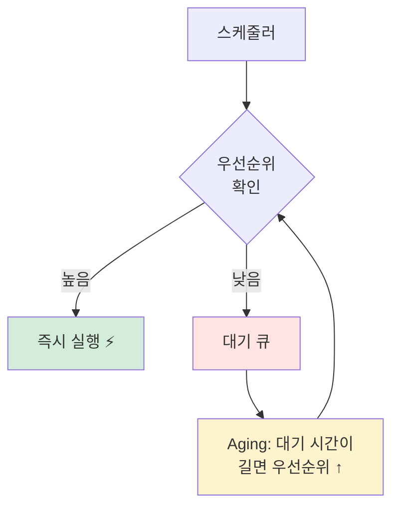

우선순위 높은 것 먼저 실행한다.
- **장점**: 중요한 작업을 빠르게 처리
- **단점**: 낮은 우선순위는 Starvation 가능 → **Aging**으로 해결 (오래 기다리면 우선순위를 올려줌)

### 스케줄링 알고리즘 비교

| 알고리즘 | 방식 | 장점 | 단점 |
|---------|------|------|------|
| FCFS | 먼저 온 순서 | 단순 | Convoy Effect |
| SJF | 짧은 것 먼저 | 대기시간 최소 | Starvation |
| Round Robin | 시간 균등 분배 | 공평, 응답 빠름 | 컨텍스트 스위칭 비용 |
| Priority | 우선순위 순 | 중요 작업 우선 | Starvation (Aging으로 해결) |

## 5. 컨텍스트 스위칭

CPU가 실행 중인 프로세스/스레드를 바꾸는 작업.

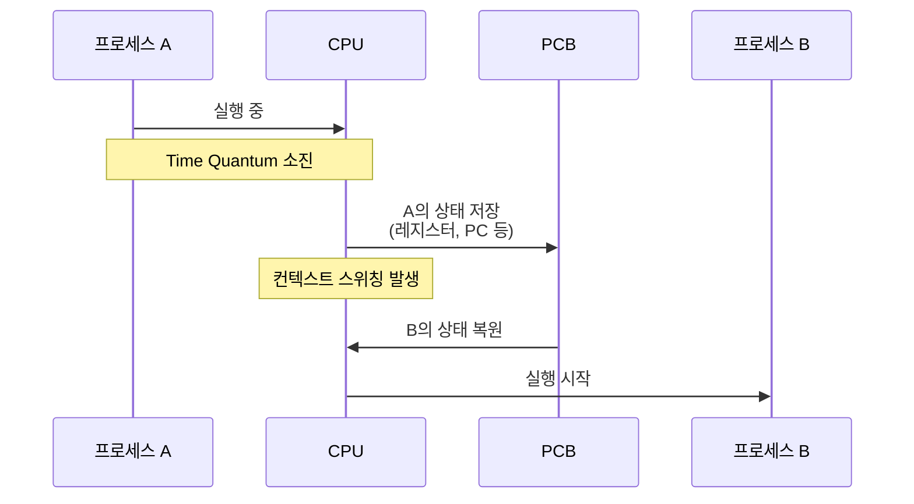

### 비용이 발생하는 이유

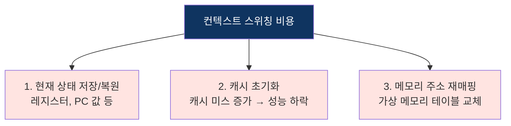

## 6. CPU 바운드 vs I/O 바운드 ⭐

**백엔드 개발자에게 가장 중요한 개념이다.**

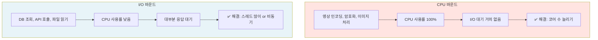

### CPU 바운드 vs I/O 바운드 시간 사용 비교

```mermaid
gantt
    title 작업 시간 비교
    dateFormat X
    axisFormat %s

    section CPU 바운드
    CPU 연산 :active, cpu1, 0, 9
    I/O 대기 :crit, io1, 9, 10

    section I/O 바운드
    CPU 연산 :active, cpu2, 0, 1
    I/O 대기 :crit, io2, 1, 5
    CPU 연산 :active, cpu3, 5, 6
    I/O 대기 :crit, io3, 6, 10
```

## 백엔드 개발자 관점 연결

### 스프링 부트 + 톰캣 요청 처리 흐름

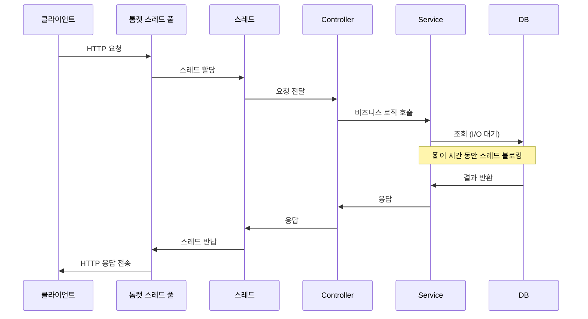

DB 조회가 많은 백엔드 서버는 **I/O 바운드**다. 그래서 톰캣 기본 스레드 풀이 200개인 것. CPU 코어가 4개여도 200개 스레드가 필요한 이유가 바로 이것이다.

### 왜 코어 4개에 스레드 200개?

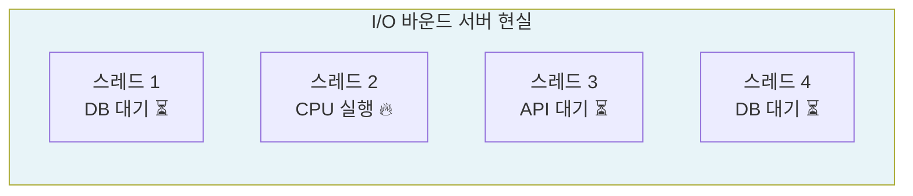

200개 스레드 중 대부분은 I/O 대기 상태이므로, 실제로 CPU를 쓰는 스레드는 소수다.

### Spring WebFlux가 나온 이유

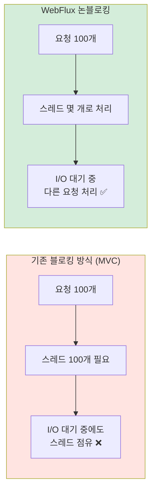

## 핵심 요약

| 개념 | 설명 | 백엔드 연결 |
|------|------|------------|
| CPU 구조 | ALU + CU + 레지스터 | 연산의 기본 단위 |
| 명령어 사이클 | Fetch → Decode → Execute → Store | 파이프라이닝으로 성능 향상 |
| 클럭/코어 | 연산 속도와 동시 처리 능력 | 서버 스펙 선택 기준 |
| 스케줄링 | 누가 CPU를 쓸지 결정 | OS가 요청을 처리하는 원리 |
| 컨텍스트 스위칭 | CPU 점유 교체 (비용 발생) | 스레드 수 vs 스위칭 비용 트레이드오프 |
| I/O 바운드 | DB 조회 많은 백엔드의 특성 | 톰캣 스레드 200개, WebFlux의 등장 이유 |
