# 메모리 (Memory)

> 데이터를 저장하고 CPU가 접근하는 공간. 계층 구조와 관리 방식을 이해하면 백엔드 성능 최적화의 기반이 된다.

## 1. 메모리 계층 구조

속도와 용량은 반비례한다. 빠를수록 비싸고 용량이 작다.

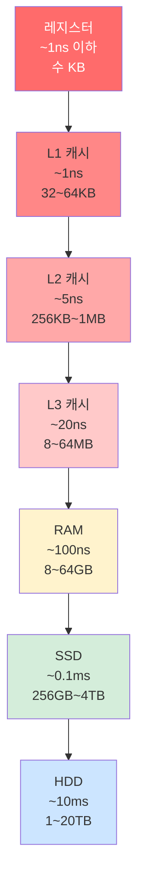

### 속도 차이 체감

| 비유 | 구간 | 속도 차이 |
|------|------|----------|
| 책상 위 메모지 → 방 안 책장 | 레지스터 → RAM | 100배 느림 |
| 방 안 책장 → 동네 도서관 | RAM → SSD | 1,000배 느림 |
| 방 안 책장 → 다른 도시 도서관 | RAM → HDD | 100,000배 느림 |

### 백엔드 연결 - Redis가 왜 빠른가?

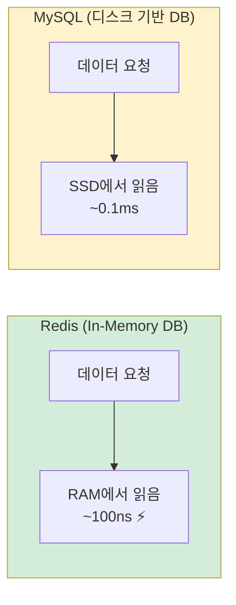

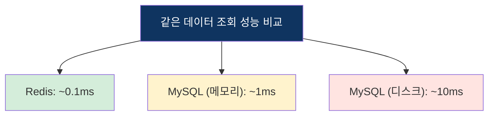

RAM vs SSD = 속도 차이 1,000배 이상. Redis가 빠른 이유가 바로 이것이다.

### 실무 활용 패턴

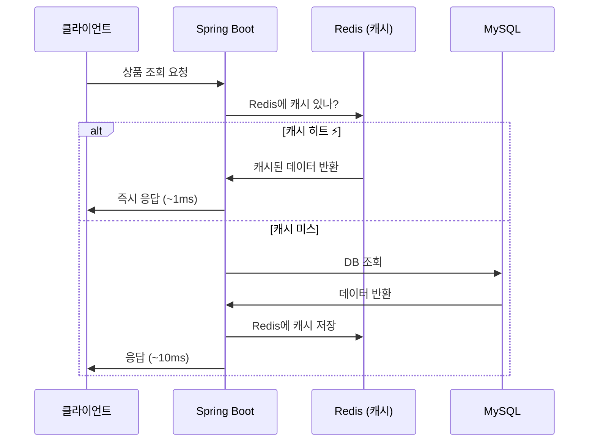

## 2. 캐시 메모리

CPU가 RAM에 직접 접근하면 느려서, 자주 쓰는 데이터를 캐시에 올려두는 것이다.

### 캐시 히트 vs 캐시 미스

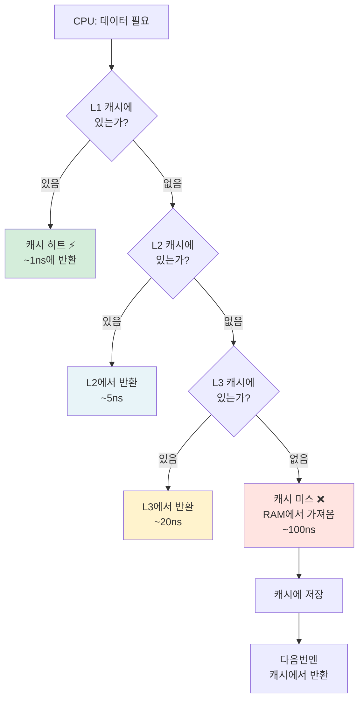

### 캐시 지역성 (Locality)
CPU가 다음에 무엇을 접근할지 예측하는 원리.

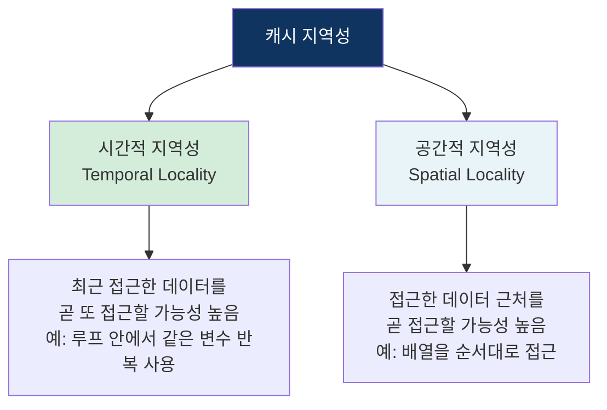

### 실제 코드 성능 차이

```java
int[][] arr = new int[1000][1000];

// ✅ 행 우선 순회 - 공간적 지역성 활용 (빠름)
for (int i = 0; i < 1000; i++)
    for (int j = 0; j < 1000; j++)
        sum += arr[i][j]; // 메모리 연속 접근 → 캐시 히트율 높음

// ❌ 열 우선 순회 - 캐시 미스 연발 (느림)
for (int i = 0; i < 1000; i++)
    for (int j = 0; j < 1000; j++)
        sum += arr[j][i]; // 메모리 불연속 접근 → 캐시 미스 연발
```

### 왜 행 우선이 빠른가?

자바 2차원 배열은 메모리에 **행 단위로 연속** 저장된다.

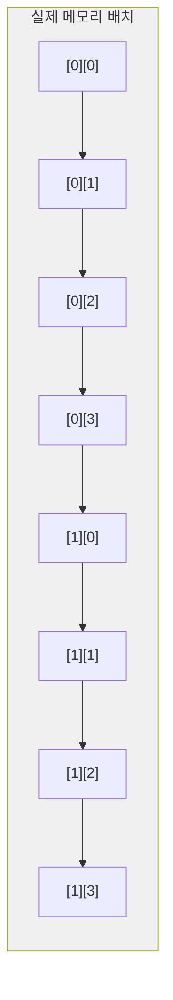

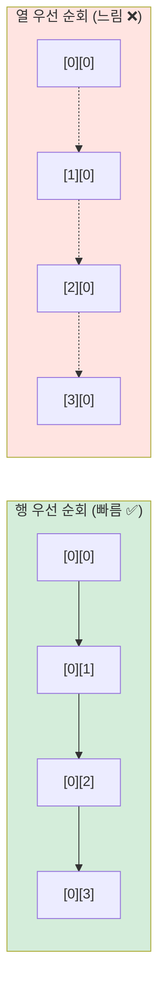

행 우선은 메모리를 순서대로 읽어서 캐시 히트율이 높고, 열 우선은 메모리를 건너뛰며 읽어서 캐시 미스가 연발된다.

## 3. 가상 메모리

RAM이 부족할 때 SSD/HDD 일부를 RAM처럼 사용하는 기술.

### 핵심 아이디어

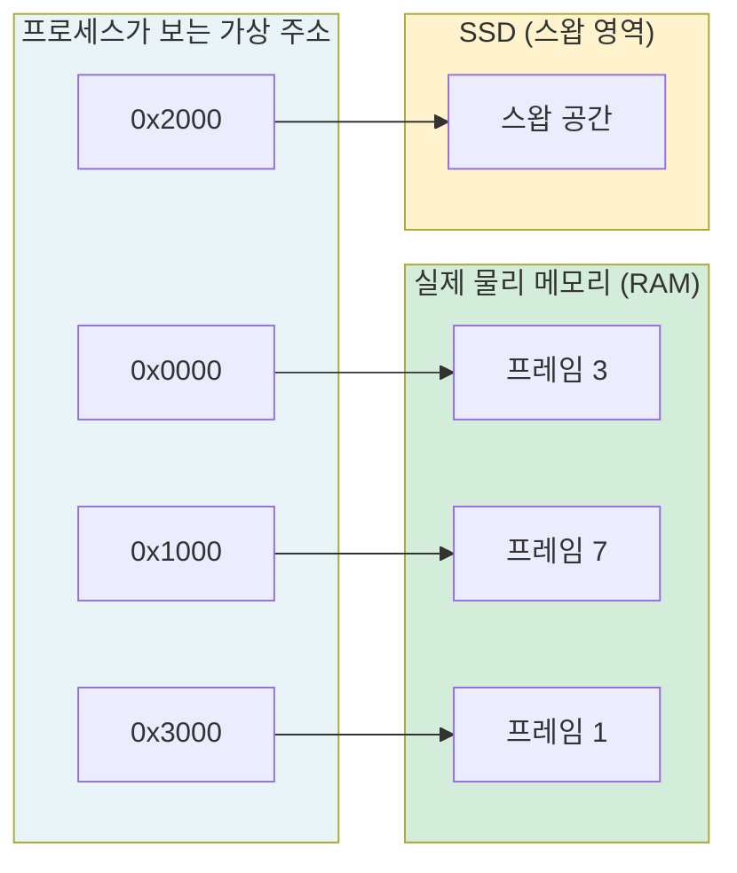

각 프로세스는 자신만의 가상 주소 공간을 가지며, OS가 가상 주소를 실제 물리 주소로 변환한다. RAM에 다 못 올리는 페이지는 SSD(스왑)에 저장된다.

### 페이지 테이블

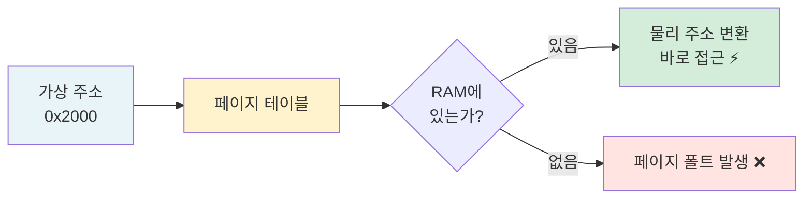

### 페이지 폴트 동작 과정

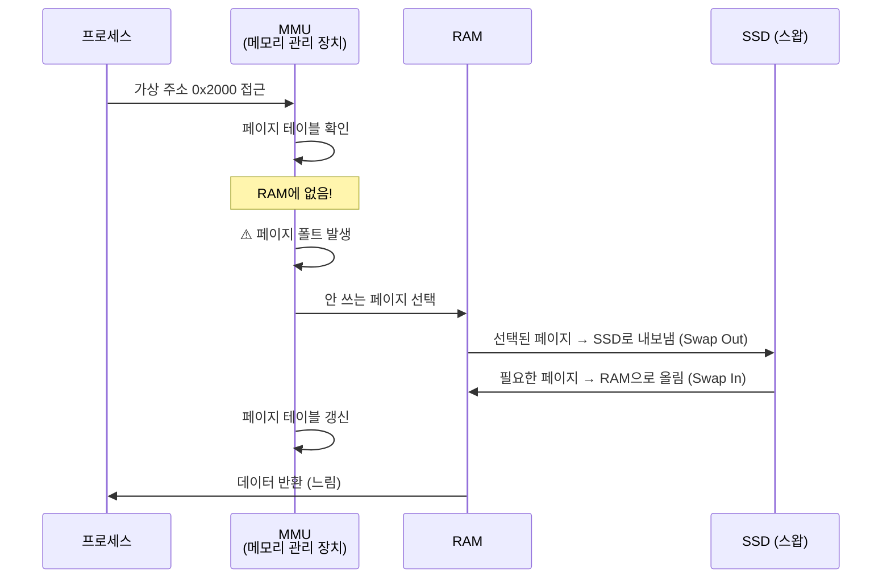

### 페이지 교체 알고리즘

RAM이 꽉 찼을 때 어떤 페이지를 내보낼지 결정하는 알고리즘.

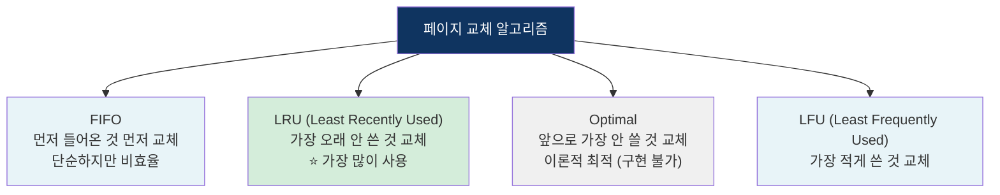

> **백엔드 연결**: Redis의 캐시 만료 정책도 LRU를 사용한다. `maxmemory-policy allkeys-lru`

**서버 연결**: 서버 RAM이 부족하면 스왑 발생 → 응답 시간이 갑자기 느려지는 원인 → 실무에서 서버 메모리 모니터링이 중요한 이유

### 스왑 발생 시 성능 영향

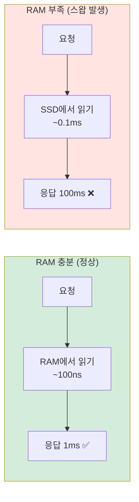

## 4. 자바 메모리 구조

자바는 JVM 위에서 돌아가기 때문에 JVM이 메모리를 관리한다.

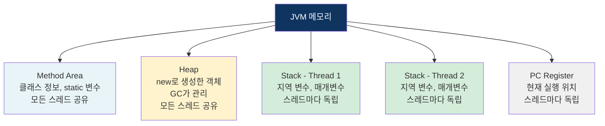

### 공유 vs 독립 영역

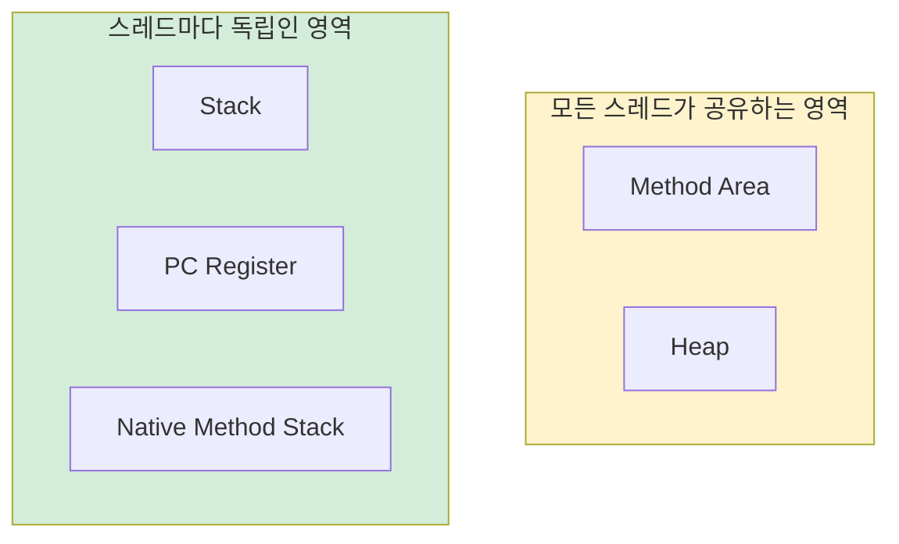

> **동시성 문제**: 공유 영역(Heap)에 여러 스레드가 동시 접근하면 Race Condition 발생 가능

### 스택 vs 힙 실제 동작

```java
public void createMember() {
    int id = 1;                    // Stack에 저장
    String name = "김사자";         // Stack에 참조값, Heap에 실제 문자열
    Member member = new Member();  // Stack에 참조값, Heap에 실제 객체
}
// 메서드 종료 → Stack 프레임 자동 해제
// Heap의 member는 GC가 나중에 정리
```

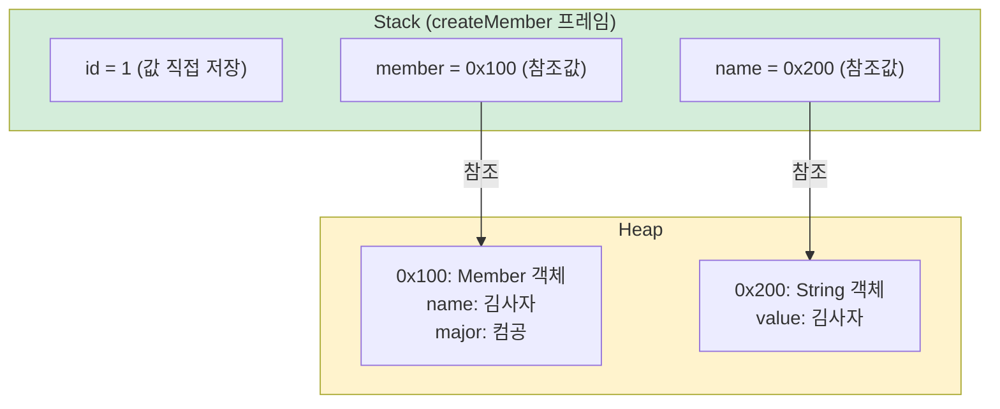

### 참조값 이해

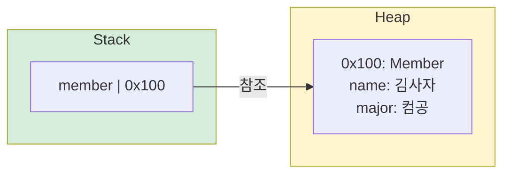

`member` 변수 자체에는 `0x100` 같은 주소값이 들어있고, 그 주소가 가리키는 Heap 공간에 실제 객체 데이터가 있다.

### 두 변수가 같은 객체를 참조하면?

```java
Member a = new Member("김사자");
Member b = a; // 같은 주소를 복사
b.setName("박사자");
System.out.println(a.getName()); // "박사자" (같은 객체)
```

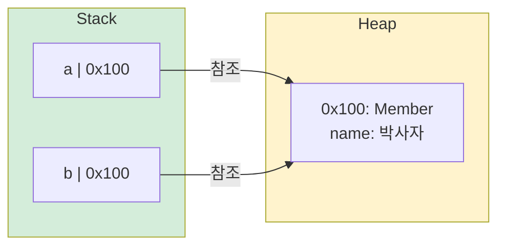

### 스택 프레임 동작 과정

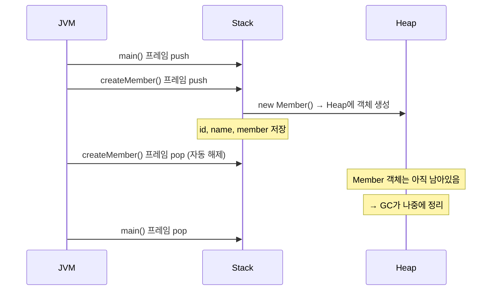

### 스택 오버플로우

```java
public void infinite() {
    infinite(); // 스택 프레임이 계속 쌓임
}
// → StackOverflowError 발생
```

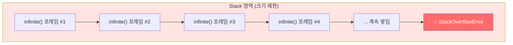

## 5. 가비지 컬렉션 (GC) ⭐

자바는 개발자가 메모리를 직접 해제 안 해도 된다. JVM의 GC가 자동으로 처리.

### C/C++ vs Java 메모리 관리 비교

```mermaid
graph LR
    subgraph C["C/C++ (수동 관리)"]
        C1["malloc() / new"] --> C2["개발자가 직접<br/>free() / delete"]
        C2 --> C3["실수하면<br/>메모리 누수 💀"]
    end
    subgraph JAVA["Java (자동 관리)"]
        J1["new 객체 생성"] --> J2["GC가 자동으로<br/>안 쓰는 객체 정리"]
        J2 --> J3["개발자는<br/>비즈니스 로직에 집중 ✅"]
    end

    style C fill:#ffe4e1
    style JAVA fill:#d4edda
```

### GC 대상 판단 - Reachability

```mermaid
flowchart TD
    ROOT["GC Root<br/>(Stack 변수, static 변수 등)"]
    ROOT --> OBJ1["객체 A<br/>참조됨 ✅"]
    OBJ1 --> OBJ2["객체 B<br/>참조됨 ✅"]
    ROOT --> OBJ3["객체 C<br/>참조됨 ✅"]

    OBJ4["객체 D<br/>참조 없음 ❌"] --> FREE1["GC 수거 대상"]
    OBJ5["객체 E<br/>참조 없음 ❌"] --> FREE2["GC 수거 대상"]

    style ROOT fill:#0f3460,color:#fff
    style OBJ1 fill:#d4edda
    style OBJ2 fill:#d4edda
    style OBJ3 fill:#d4edda
    style OBJ4 fill:#ffe4e1
    style OBJ5 fill:#ffe4e1
    style FREE1 fill:#cce5ff
    style FREE2 fill:#cce5ff
```

GC Root에서 참조 체인을 따라갈 수 있는 객체는 살아남고, 참조 체인이 끊긴 객체는 수거 대상이 된다.

### Heap 세대별 구조

```mermaid
graph TB
    HEAP[Heap]
    HEAP --> YOUNG[Young Generation<br/>새로 생성된 객체<br/>Minor GC 대상]
    HEAP --> OLD[Old Generation<br/>오래 살아남은 객체<br/>Major GC 대상]

    YOUNG --> EDEN["Eden<br/>객체 최초 생성 장소"]
    YOUNG --> S0["Survivor 0<br/>Minor GC 후 생존 객체"]
    YOUNG --> S1["Survivor 1<br/>S0에서 다시 생존한 객체"]

    style HEAP fill:#0f3460,color:#fff
    style YOUNG fill:#d4edda
    style OLD fill:#fff3cd
    style EDEN fill:#e8f4f8
    style S0 fill:#e8f4f8
    style S1 fill:#e8f4f8
```

### 왜 세대를 나누는가? (Generational Hypothesis)

```mermaid
graph LR
    subgraph 관찰["관찰된 사실"]
        F1["대부분의 객체는<br/>금방 죽는다 (약 95%)"]
        F2["오래 살아남은 객체는<br/>계속 살아남는다"]
    end
    subgraph 전략["GC 전략"]
        S1A["Young 영역은 자주,<br/>빠르게 청소 (Minor GC)"]
        S2A["Old 영역은 가끔,<br/>신중하게 청소 (Major GC)"]
    end
    F1 --> S1A
    F2 --> S2A

    style 관찰 fill:#e8f4f8
    style 전략 fill:#d4edda
```

### GC 동작 과정

```mermaid
sequenceDiagram
    participant App as 애플리케이션
    participant Eden as Eden
    participant S0 as Survivor 0
    participant S1 as Survivor 1
    participant Old as Old Generation

    App->>Eden: new 객체 생성
    App->>Eden: new 객체 생성
    App->>Eden: new 객체 생성
    Note over Eden: Eden 꽉 참!

    Note over Eden,S0: 🔄 Minor GC 발생
    Eden->>S0: 살아있는 것만 S0로 이동
    Note over Eden: 죽은 객체 일괄 제거 (빠름 ⚡)

    Note over S0,S1: 🔄 다음 Minor GC
    S0->>S1: 살아있으면 S1으로 이동<br/>(age +1)

    Note over S1,Old: age가 임계값 초과
    S1->>Old: Old Generation으로 승격 (Promotion)

    Note over Old: Old도 꽉 참!
    Note over App,Old: 🔴 Major GC (Full GC)<br/>Stop-The-World ⚠️<br/>모든 스레드 멈춤
```

### Stop-The-World ⚠️

GC 실행 중 모든 애플리케이션 스레드가 정지된다.

```mermaid
gantt
    title Stop-The-World 영향
    dateFormat X
    axisFormat %s

    section 애플리케이션
    요청 처리 :active, a1, 0, 3
    STW 정지 :crit, a2, 3, 5
    요청 처리 :active, a3, 5, 10

    section GC
    대기 :done, g1, 0, 3
    GC 실행 :crit, g2, 3, 5
    대기 :done, g3, 5, 10
```

- API 응답이 수백ms ~ 수초 지연될 수 있음
- 실무에서 GC 튜닝이 중요한 이유
- 객체를 불필요하게 많이 생성하면 GC 부하 증가

### GC 알고리즘 비교

```mermaid
graph LR
    subgraph Serial["Serial GC"]
        SG["싱글 스레드<br/>작은 서버용<br/>STW 김"]
    end
    subgraph Parallel["Parallel GC"]
        PG["멀티 스레드<br/>처리량 중시<br/>STW 중간"]
    end
    subgraph G1["G1 GC ⭐"]
        G1G["Java 9+ 기본<br/>Region 기반<br/>STW 최소화"]
    end
    subgraph ZGC["ZGC"]
        ZG["Java 15+<br/>대용량 Heap<br/>STW 1ms 미만"]
    end

    style Serial fill:#ffe4e1
    style Parallel fill:#fff3cd
    style G1 fill:#d4edda
    style ZGC fill:#e8f4f8
```

| 알고리즘 | Java 버전 | STW 시간 | 적합한 환경 |
|---------|----------|---------|-----------|
| Serial GC | 전체 | 길다 | 클라이언트, 작은 Heap |
| Parallel GC | 전체 | 중간 | 배치 처리, 처리량 중시 |
| G1 GC ⭐ | 9+ 기본 | 짧다 | 일반 서버 (가장 많이 사용) |
| ZGC | 15+ | 극히 짧다 (< 1ms) | 대용량 Heap, 저지연 서비스 |

## 6. 메모리 누수 (Memory Leak)

GC가 있어도 메모리 누수가 발생할 수 있다. 참조가 끊기지 않으면 GC가 지우지 못한다.

```mermaid
graph LR
    subgraph 정상["정상 - 참조 끊김"]
        A1["member = null"] -.->|참조 없음| O1[객체]
        O1 -->|GC 수거| FREE1["메모리 해제 ✅"]
    end

    subgraph 누수["누수 - 참조 안 끊김"]
        A2["static Map"] -->|참조 유지| O2[객체]
        O2 -->|GC 못 지움| LEAK["메모리 계속 증가 ❌"]
    end

    style 정상 fill:#d4edda
    style 누수 fill:#ffe4e1
```

### 메모리 누수 시 서버 상태 변화

```mermaid
graph LR
    T1["서버 시작<br/>Heap 사용 30%"] --> T2["운영 1일<br/>Heap 사용 50%"]
    T2 --> T3["운영 3일<br/>Heap 사용 70%"]
    T3 --> T4["운영 7일<br/>Heap 사용 90%"]
    T4 --> T5["💥 OutOfMemoryError<br/>서버 다운"]

    style T1 fill:#d4edda
    style T2 fill:#fff3cd
    style T3 fill:#ffa8a8
    style T4 fill:#ff8787
    style T5 fill:#ff6b6b,color:#fff
```

### 백엔드에서 흔한 메모리 누수 원인

```mermaid
graph TB
    LEAK[메모리 누수 원인 Top 4]
    LEAK --> L1["1. static 컬렉션<br/>추가만 하고 삭제 안 함"]
    LEAK --> L2["2. 이벤트 리스너<br/>등록 후 해제 안 함"]
    LEAK --> L3["3. DB 커넥션 / 스트림<br/>close() 호출 안 함"]
    LEAK --> L4["4. 무제한 캐시<br/>TTL 없이 계속 쌓음"]

    style LEAK fill:#0f3460,color:#fff
    style L1 fill:#ffe4e1
    style L2 fill:#ffe4e1
    style L3 fill:#ffe4e1
    style L4 fill:#ffe4e1
```

### 올바른 자원 관리 예시

```java
// ❌ 나쁜 예 - close 안 함
public void readFile() {
    InputStream is = new FileInputStream("data.txt");
    // 예외 발생 시 close 안 됨 → 메모리 누수
}

// ✅ 좋은 예 - try-with-resources
public void readFile() {
    try (InputStream is = new FileInputStream("data.txt")) {
        // 자동으로 close() 호출
    }
}
```

## 핵심 요약

| 개념 | 핵심 내용 | 백엔드 연결 |
|------|----------|------------|
| 메모리 계층 | 빠를수록 비싸고 작다 | Redis가 빠른 이유 (RAM vs SSD) |
| 캐시 지역성 | 시간적/공간적 지역성 | 코드 최적화, 배열 순회 방향 |
| 가상 메모리 | SSD를 RAM처럼 사용 | 서버 스왑 발생 시 성능 저하 원인 |
| JVM 메모리 | Heap(공유) + Stack(독립) | 객체 생명주기, 동시성 문제의 근원 |
| GC | 안 쓰는 객체 자동 정리 | STW로 인한 응답 지연, GC 튜닝 |
| 메모리 누수 | 참조 안 끊기면 GC 무력화 | 서버가 점점 느려지다 OOM 발생 |
