# 프로세스 (Process)

> 프로세스는 실행 중인 프로그램. OS가 관리하는 작업의 기본 단위이며, 백엔드 서버 아키텍처의 근간이다.

## 1. 프로그램 vs 프로세스

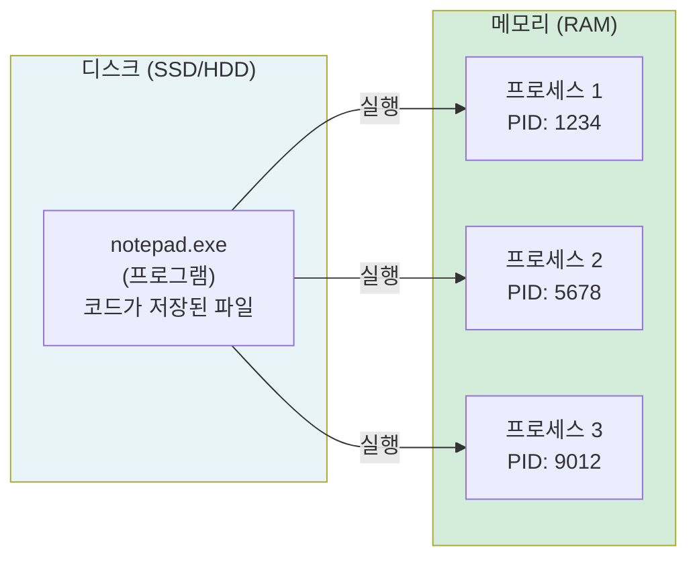
```mermaid
graph LR
    subgraph 디스크["디스크 (SSD/HDD)"]
        P1["notepad.exe<br/>(프로그램)<br/>코드가 저장된 파일"]
    end
    subgraph 메모리["메모리 (RAM)"]
        I1["프로세스 1<br/>PID: 1234"]
        I2["프로세스 2<br/>PID: 5678"]
        I3["프로세스 3<br/>PID: 9012"]
    end

    P1 -->|실행| I1
    P1 -->|실행| I2
    P1 -->|실행| I3

    style 디스크 fill:#e8f4f8
    style 메모리 fill:#d4edda
```

| 구분 | 프로그램 | 프로세스 |
|------|---------|---------|
| 상태 | 정적 (파일) | 동적 (실행 중) |
| 위치 | 디스크에 저장 | 메모리에 로드 |
| 비유 | 레시피 (종이) | 요리 중인 상태 (진행 중) |

하나의 프로그램으로 여러 프로세스를 실행할 수 있다. 메모장 하나를 3개 열면 프로세스 3개가 생긴다.

### 자바에서의 프로세스

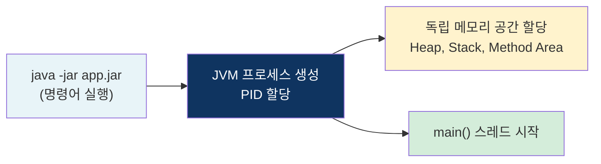
```mermaid
graph LR
    JAVA["java -jar app.jar<br/>(명령어 실행)"] --> JVM["JVM 프로세스 생성<br/>PID 할당"]
    JVM --> MEM["독립 메모리 공간 할당<br/>Heap, Stack, Method Area"]
    JVM --> MAIN["main() 스레드 시작"]

    style JAVA fill:#e8f4f8
    style JVM fill:#0f3460,color:#fff
    style MEM fill:#fff3cd
    style MAIN fill:#d4edda
```

스프링 부트 서버를 실행하면 JVM 프로세스 1개가 생성된다.

## 2. 프로세스 메모리 구조

각 프로세스는 **완전히 독립된 메모리 공간**을 가진다.

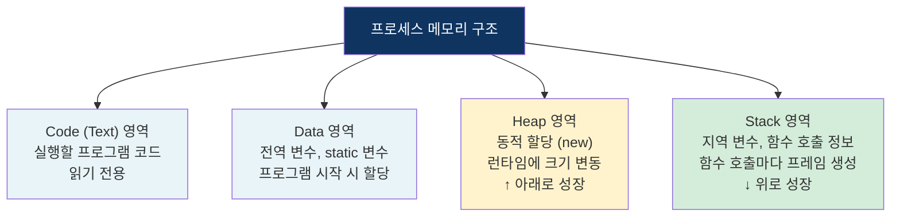
```mermaid
graph TB
    PROC["프로세스 메모리 구조"]
    PROC --> CODE["Code (Text) 영역<br/>실행할 프로그램 코드<br/>읽기 전용"]
    PROC --> DATA["Data 영역<br/>전역 변수, static 변수<br/>프로그램 시작 시 할당"]
    PROC --> HEAP["Heap 영역<br/>동적 할당 (new)<br/>런타임에 크기 변동<br/>↑ 아래로 성장"]
    PROC --> STACK["Stack 영역<br/>지역 변수, 함수 호출 정보<br/>함수 호출마다 프레임 생성<br/>↓ 위로 성장"]

    style PROC fill:#0f3460,color:#fff
    style CODE fill:#e8f4f8
    style DATA fill:#e8f4f8
    style HEAP fill:#fff3cd
    style STACK fill:#d4edda
```

### 메모리 레이아웃 상세

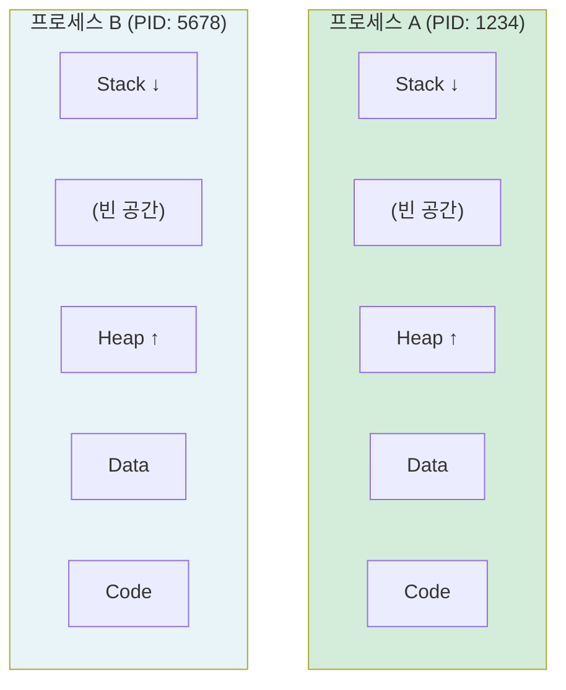
```mermaid
graph TB
    subgraph 프로세스A["프로세스 A (PID: 1234)"]
        A_S["Stack ↓"]
        A_FREE["(빈 공간)"]
        A_H["Heap ↑"]
        A_D["Data"]
        A_C["Code"]
    end

    subgraph 프로세스B["프로세스 B (PID: 5678)"]
        B_S["Stack ↓"]
        B_FREE["(빈 공간)"]
        B_H["Heap ↑"]
        B_D["Data"]
        B_C["Code"]
    end

    style 프로세스A fill:#d4edda
    style 프로세스B fill:#e8f4f8
```

프로세스 A가 프로세스 B의 메모리에 **직접 접근이 불가능**하다. 이것이 프로세스 격리(Isolation)이다.

### Heap과 Stack이 서로 다가가면?

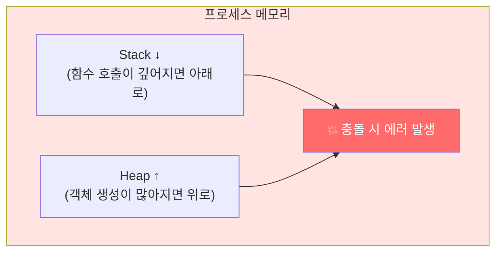
```mermaid
graph TB
    subgraph 메모리["프로세스 메모리"]
        S["Stack ↓<br/>(함수 호출이 깊어지면 아래로)"]
        CRASH["💥 충돌 시 에러 발생"]
        H["Heap ↑<br/>(객체 생성이 많아지면 위로)"]
    end

    S --> CRASH
    H --> CRASH

    style 메모리 fill:#ffe4e1
    style CRASH fill:#ff6b6b,color:#fff
```

Stack이 너무 깊어지면 StackOverflow, Heap이 너무 커지면 OutOfMemory 에러가 발생한다.

## 3. 프로세스 상태

프로세스는 생성부터 종료까지 여러 상태를 거친다.

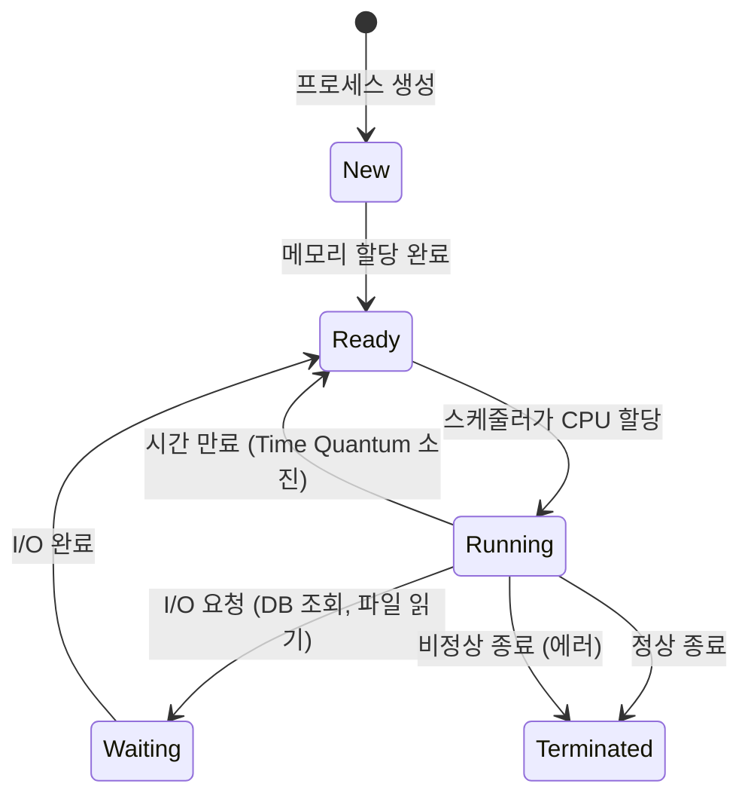
```mermaid
stateDiagram-v2
    [*] --> New: 프로세스 생성
    New --> Ready: 메모리 할당 완료
    Ready --> Running: 스케줄러가 CPU 할당
    Running --> Ready: 시간 만료 (Time Quantum 소진)
    Running --> Waiting: I/O 요청 (DB 조회, 파일 읽기)
    Waiting --> Ready: I/O 완료
    Running --> Terminated: 정상 종료
    Running --> Terminated: 비정상 종료 (에러)
```

### 상태 전이 상세

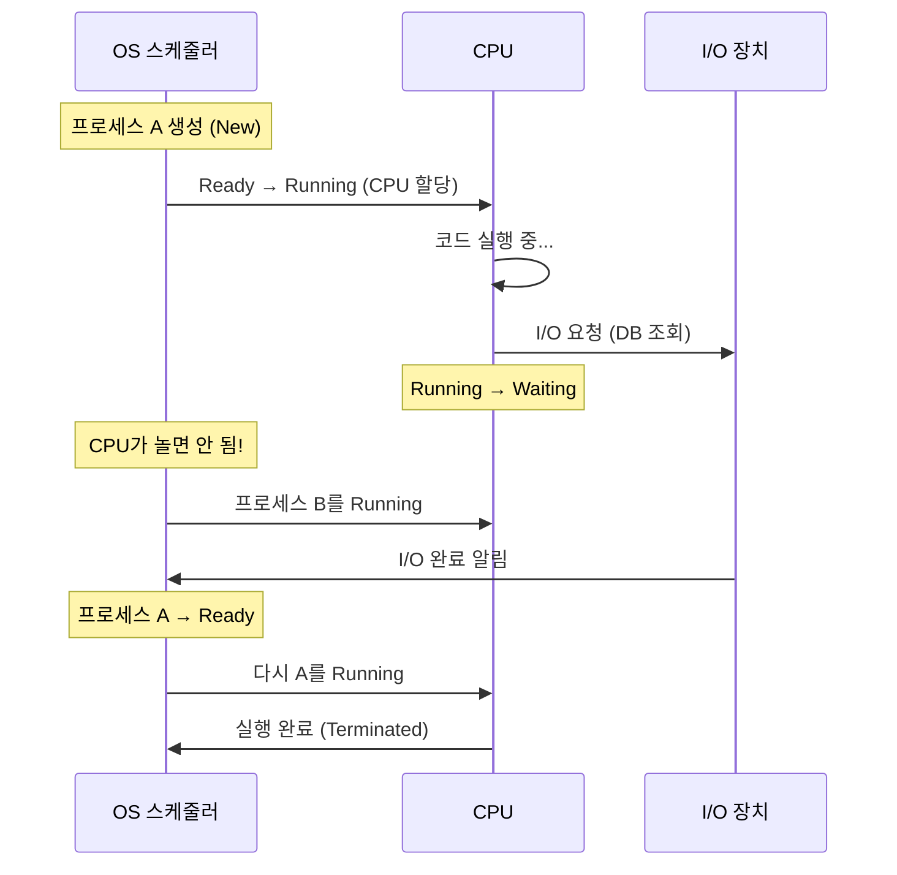
```mermaid
sequenceDiagram
    participant OS as OS 스케줄러
    participant CPU as CPU
    participant IO as I/O 장치

    Note over OS: 프로세스 A 생성 (New)
    OS->>CPU: Ready → Running (CPU 할당)
    CPU->>CPU: 코드 실행 중...
    CPU->>IO: I/O 요청 (DB 조회)
    Note over CPU: Running → Waiting
    Note over OS: CPU가 놀면 안 됨!
    OS->>CPU: 프로세스 B를 Running
    IO->>OS: I/O 완료 알림
    Note over OS: 프로세스 A → Ready
    OS->>CPU: 다시 A를 Running
    CPU->>OS: 실행 완료 (Terminated)
```

| 상태 | 설명 | 예시 |
|------|------|------|
| New | 프로세스 생성됨 | `java -jar app.jar` 실행 직후 |
| Ready | CPU 할당 대기 중 | 실행 준비 완료, 스케줄러 대기 |
| Running | CPU에서 실행 중 | 코드 실행 중 |
| Waiting | I/O 대기 중 | DB 조회, 파일 읽기 대기 |
| Terminated | 종료됨 | 프로세스 종료 또는 에러 |

## 4. PCB (Process Control Block)

OS가 프로세스를 관리하기 위한 **정보 덩어리**. 프로세스 1개당 PCB 1개가 존재한다.

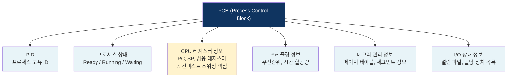
```mermaid
graph TB
    PCB["PCB (Process Control Block)"]
    PCB --> PID["PID<br/>프로세스 고유 ID"]
    PCB --> STATE["프로세스 상태<br/>Ready / Running / Waiting"]
    PCB --> CPU_INFO["CPU 레지스터 정보<br/>PC, SP, 범용 레지스터<br/>⭐ 컨텍스트 스위칭 핵심"]
    PCB --> SCHED["스케줄링 정보<br/>우선순위, 시간 할당량"]
    PCB --> MEM_INFO["메모리 관리 정보<br/>페이지 테이블, 세그먼트 정보"]
    PCB --> IO_INFO["I/O 상태 정보<br/>열린 파일, 할당 장치 목록"]

    style PCB fill:#0f3460,color:#fff
    style PID fill:#e8f4f8
    style STATE fill:#e8f4f8
    style CPU_INFO fill:#fff3cd
    style SCHED fill:#e8f4f8
    style MEM_INFO fill:#e8f4f8
    style IO_INFO fill:#e8f4f8
```

### 컨텍스트 스위칭에서 PCB의 역할

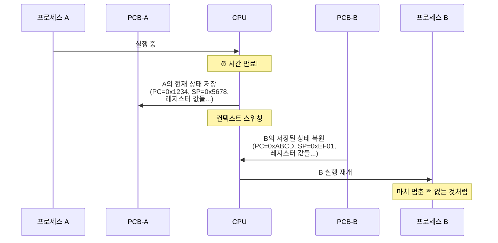
```mermaid
sequenceDiagram
    participant A as 프로세스 A
    participant PCB_A as PCB-A
    participant CPU as CPU
    participant PCB_B as PCB-B
    participant B as 프로세스 B

    A->>CPU: 실행 중
    Note over CPU: ⏰ 시간 만료!
    CPU->>PCB_A: A의 현재 상태 저장<br/>(PC=0x1234, SP=0x5678,<br/>레지스터 값들...)
    Note over CPU: 컨텍스트 스위칭
    PCB_B->>CPU: B의 저장된 상태 복원<br/>(PC=0xABCD, SP=0xEF01,<br/>레지스터 값들...)
    CPU->>B: B 실행 재개
    Note over B: 마치 멈춘 적 없는 것처럼
```

PCB에 저장해둔 정보 덕분에 프로세스가 멈췄다가 다시 시작해도 이전 상태에서 이어서 실행할 수 있다.

## 5. 프로세스 생성 방식

### fork()와 exec()

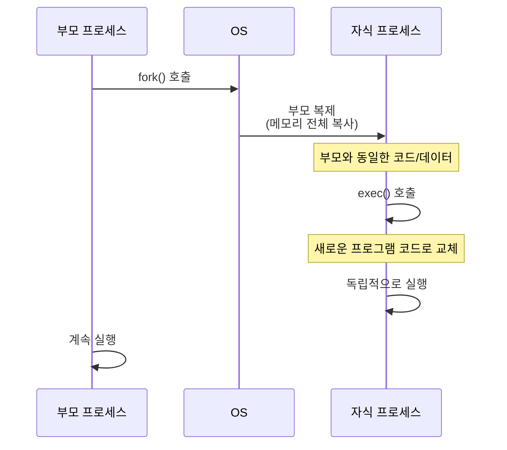
```mermaid
sequenceDiagram
    participant P as 부모 프로세스
    participant OS as OS
    participant C as 자식 프로세스

    P->>OS: fork() 호출
    OS->>C: 부모 복제<br/>(메모리 전체 복사)
    Note over C: 부모와 동일한 코드/데이터
    C->>C: exec() 호출
    Note over C: 새로운 프로그램 코드로 교체
    C->>C: 독립적으로 실행
    P->>P: 계속 실행
```

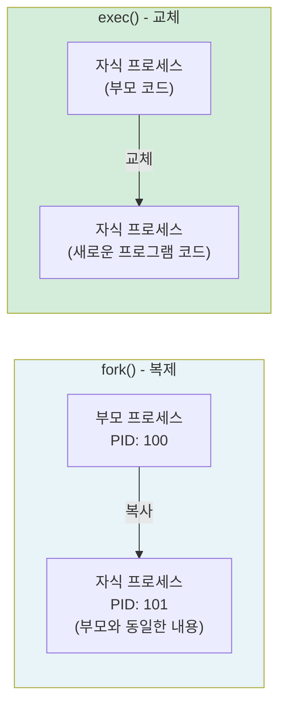
```mermaid
graph LR
    subgraph fork["fork() - 복제"]
        P1["부모 프로세스<br/>PID: 100"] -->|복사| C1["자식 프로세스<br/>PID: 101<br/>(부모와 동일한 내용)"]
    end
    subgraph exec["exec() - 교체"]
        C2["자식 프로세스<br/>(부모 코드)"] -->|교체| C3["자식 프로세스<br/>(새로운 프로그램 코드)"]
    end

    style fork fill:#e8f4f8
    style exec fill:#d4edda
```

### 자바에서의 프로세스 생성

```java
// 새로운 프로세스 생성
ProcessBuilder pb = new ProcessBuilder("python3", "script.py");
Process process = pb.start(); // fork + exec 발생

// 프로세스 간 통신은 I/O 스트림으로
InputStream is = process.getInputStream();
```

## 6. IPC (Inter-Process Communication)

프로세스끼리 메모리가 격리되어 있어서 통신하려면 특별한 방법이 필요하다.

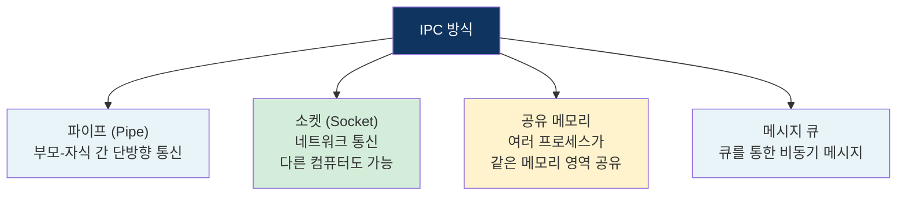
```mermaid
graph TB
    IPC["IPC 방식"]
    IPC --> PIPE["파이프 (Pipe)<br/>부모-자식 간 단방향 통신"]
    IPC --> SOCKET["소켓 (Socket)<br/>네트워크 통신<br/>다른 컴퓨터도 가능"]
    IPC --> SHM["공유 메모리<br/>여러 프로세스가<br/>같은 메모리 영역 공유"]
    IPC --> MQ["메시지 큐<br/>큐를 통한 비동기 메시지"]

    style IPC fill:#0f3460,color:#fff
    style PIPE fill:#e8f4f8
    style SOCKET fill:#d4edda
    style SHM fill:#fff3cd
    style MQ fill:#e8f4f8
```

### 파이프 (Pipe)

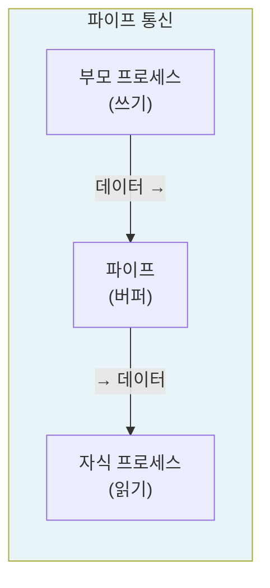
```mermaid
graph LR
    subgraph 파이프통신["파이프 통신"]
        P1["부모 프로세스<br/>(쓰기)"] -->|"데이터 →"| PIPE["파이프<br/>(버퍼)"]
        PIPE -->|"→ 데이터"| P2["자식 프로세스<br/>(읽기)"]
    end

    style 파이프통신 fill:#e8f4f8
```

단방향 통신. 양방향이 필요하면 파이프 2개를 만들어야 한다.

### 소켓 (Socket) ⭐

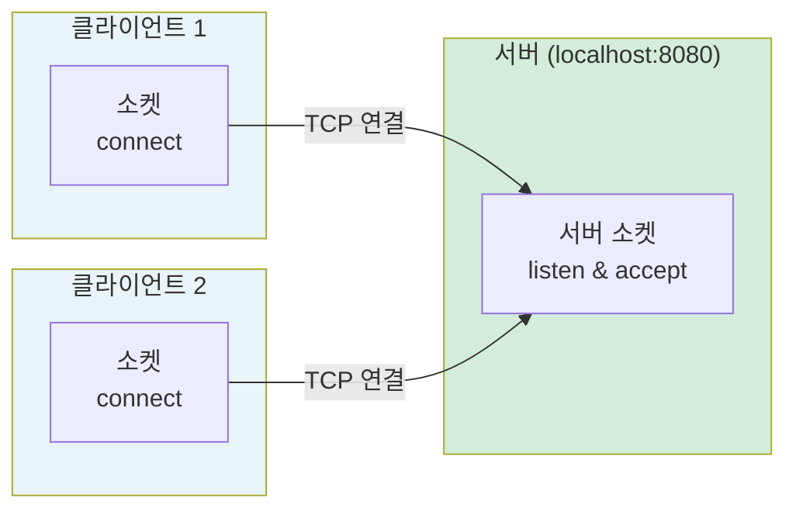
```mermaid
graph LR
    subgraph 서버["서버 (localhost:8080)"]
        S["서버 소켓<br/>listen & accept"]
    end
    subgraph 클라이언트1["클라이언트 1"]
        C1["소켓<br/>connect"]
    end
    subgraph 클라이언트2["클라이언트 2"]
        C2["소켓<br/>connect"]
    end

    C1 -->|"TCP 연결"| S
    C2 -->|"TCP 연결"| S

    style 서버 fill:#d4edda
    style 클라이언트1 fill:#e8f4f8
    style 클라이언트2 fill:#e8f4f8
```

네트워크를 통한 통신. 다른 컴퓨터의 프로세스와도 통신 가능. 백엔드에서 가장 많이 사용하는 IPC 방식이다.

### 공유 메모리 (Shared Memory)

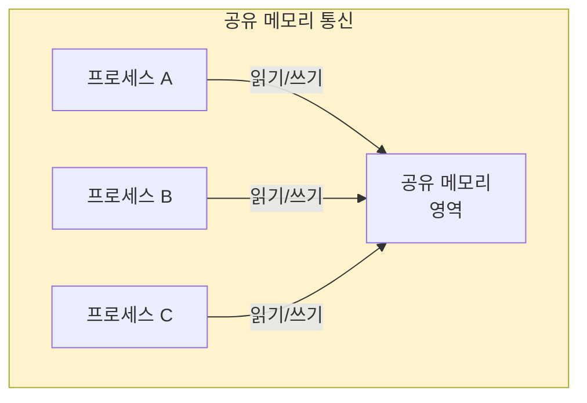
```mermaid
graph TB
    subgraph 공유메모리["공유 메모리 통신"]
        P1["프로세스 A"] -->|읽기/쓰기| SHM["공유 메모리<br/>영역"]
        P2["프로세스 B"] -->|읽기/쓰기| SHM
        P3["프로세스 C"] -->|읽기/쓰기| SHM
    end

    style 공유메모리 fill:#fff3cd
```

가장 빠른 IPC 방식. 하지만 동시 접근 시 동기화 문제가 생길 수 있어서 세마포어 등으로 보호해야 한다.

### 메시지 큐 (Message Queue)

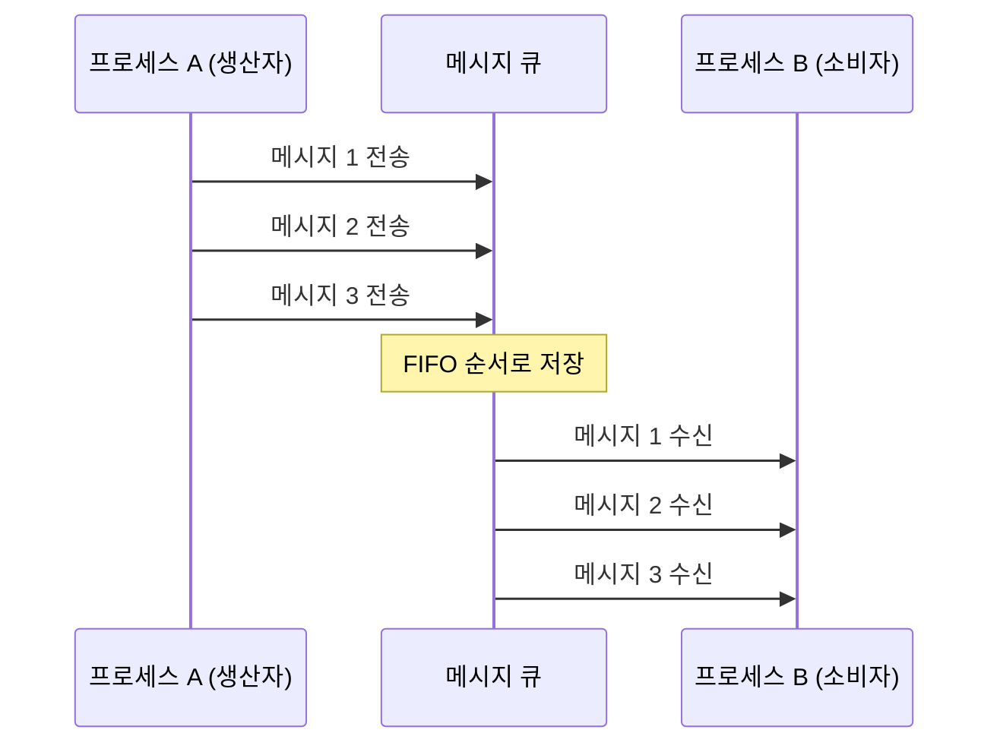
```mermaid
sequenceDiagram
    participant P1 as 프로세스 A (생산자)
    participant Q as 메시지 큐
    participant P2 as 프로세스 B (소비자)

    P1->>Q: 메시지 1 전송
    P1->>Q: 메시지 2 전송
    P1->>Q: 메시지 3 전송
    Note over Q: FIFO 순서로 저장
    Q->>P2: 메시지 1 수신
    Q->>P2: 메시지 2 수신
    Q->>P2: 메시지 3 수신
```

비동기로 메시지를 주고받는 방식. 생산자와 소비자가 동시에 실행되지 않아도 된다.

> **백엔드 연결**: Kafka, RabbitMQ 같은 메시지 브로커가 이 개념의 확장이다.

### IPC 방식 비교

| 방식 | 속도 | 범위 | 복잡도 | 실무 예시 |
|------|------|------|--------|----------|
| 파이프 | 빠름 | 같은 머신 | 낮음 | 리눅스 쉘 파이프 `\|` |
| 소켓 | 보통 | 네트워크 가능 | 중간 | HTTP API 통신, DB 연결 |
| 공유 메모리 | 매우 빠름 | 같은 머신 | 높음 (동기화) | 고성능 캐시 |
| 메시지 큐 | 보통 | 네트워크 가능 | 중간 | Kafka, RabbitMQ |

## 7. 백엔드 개발자 관점 연결

### 모놀리식 vs MSA (프로세스 격리 관점)

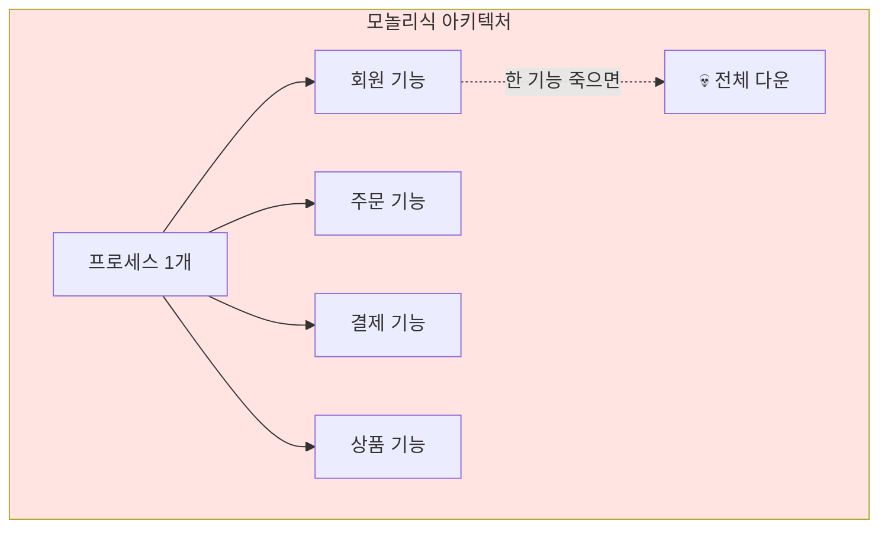
```mermaid
graph TB
    subgraph 모놀리식["모놀리식 아키텍처"]
        MONO["프로세스 1개"]
        MONO --> USER_M["회원 기능"]
        MONO --> ORDER_M["주문 기능"]
        MONO --> PAY_M["결제 기능"]
        MONO --> PROD_M["상품 기능"]
        USER_M -.->|"한 기능 죽으면"| DEAD_M["💀 전체 다운"]
    end

    style 모놀리식 fill:#ffe4e1
```

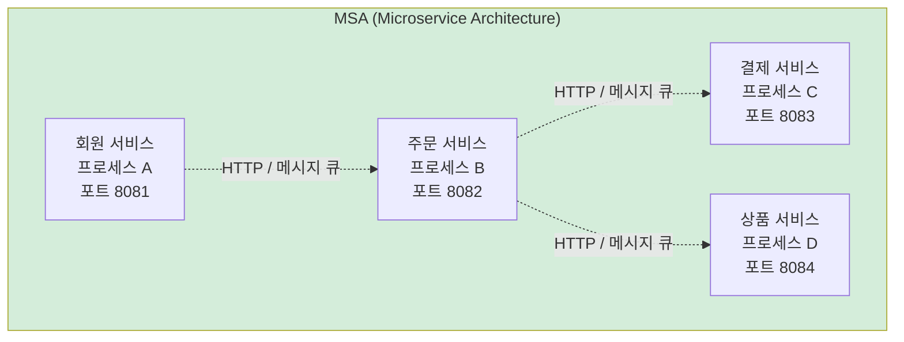
```mermaid
graph TB
    subgraph MSA["MSA (Microservice Architecture)"]
        USER_S["회원 서비스<br/>프로세스 A<br/>포트 8081"]
        ORDER_S["주문 서비스<br/>프로세스 B<br/>포트 8082"]
        PAY_S["결제 서비스<br/>프로세스 C<br/>포트 8083"]
        PROD_S["상품 서비스<br/>프로세스 D<br/>포트 8084"]
        
        USER_S -.->|"HTTP / 메시지 큐"| ORDER_S
        ORDER_S -.->|"HTTP / 메시지 큐"| PAY_S
        ORDER_S -.->|"HTTP / 메시지 큐"| PROD_S
    end

    style MSA fill:#d4edda
```

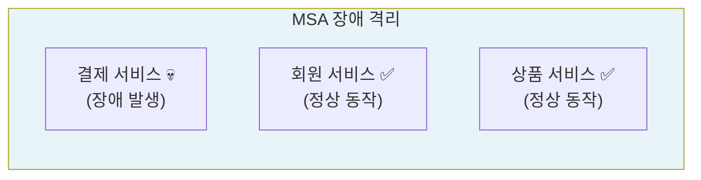
```mermaid
graph LR
    subgraph 격리효과["MSA 장애 격리"]
        P1["결제 서비스 💀<br/>(장애 발생)"]
        P2["회원 서비스 ✅<br/>(정상 동작)"]
        P3["상품 서비스 ✅<br/>(정상 동작)"]
    end

    style 격리효과 fill:#e8f4f8
```

MSA에서 각 서비스는 별도 프로세스이므로, 한 서비스가 죽어도 다른 서비스는 정상 동작한다. 프로세스 격리의 장점을 활용한 아키텍처이다.

### Docker 컨테이너 = 프로세스 격리의 발전

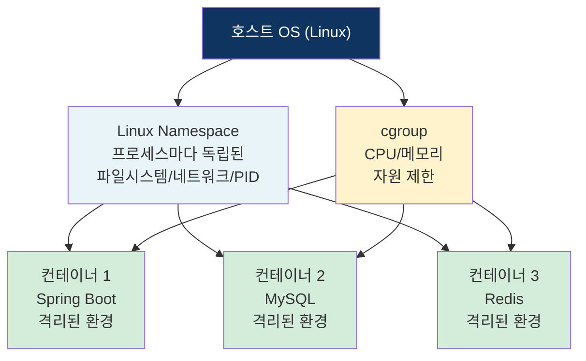
```mermaid
graph TB
    HOST["호스트 OS (Linux)"]
    HOST --> NS["Linux Namespace<br/>프로세스마다 독립된<br/>파일시스템/네트워크/PID"]
    HOST --> CG["cgroup<br/>CPU/메모리<br/>자원 제한"]
    NS --> C1["컨테이너 1<br/>Spring Boot<br/>격리된 환경"]
    NS --> C2["컨테이너 2<br/>MySQL<br/>격리된 환경"]
    NS --> C3["컨테이너 3<br/>Redis<br/>격리된 환경"]
    CG --> C1
    CG --> C2
    CG --> C3

    style HOST fill:#0f3460,color:#fff
    style NS fill:#e8f4f8
    style CG fill:#fff3cd
    style C1 fill:#d4edda
    style C2 fill:#d4edda
    style C3 fill:#d4edda
```

| 개념 | 기술 | 격리 수준 |
|------|------|----------|
| 프로세스 | OS의 기본 격리 | 메모리 격리 |
| 컨테이너 | Namespace + cgroup | 메모리 + 파일시스템 + 네트워크 |
| 가상머신 | 하이퍼바이저 | OS 전체 격리 |

### 스프링 부트와 프로세스

```mermaid
sequenceDiagram
    participant DEV as 개발자
    participant OS as OS
    participant JVM as JVM 프로세스
    participant TOMCAT as 내장 톰캣

    DEV->>OS: java -jar app.jar
    OS->>JVM: 프로세스 생성 (PID 할당)
    JVM->>JVM: 메모리 공간 할당<br/>(Heap, Stack, Method Area)
    JVM->>TOMCAT: 내장 톰캣 초기화
    TOMCAT->>TOMCAT: 스레드 풀 생성 (기본 200개)
    Note over JVM: 포트 8080 바인딩
    Note over JVM: 요청 대기 상태
```

## 핵심 요약

| 개념 | 핵심 내용 | 백엔드 연결 |
|------|----------|------------|
| 프로그램 vs 프로세스 | 파일 vs 실행 중인 인스턴스 | JVM = 1개의 프로세스 |
| 메모리 구조 | Code/Data/Heap/Stack | Heap 공유 → 동시성 문제 근원 |
| 프로세스 상태 | New→Ready→Running→Waiting→Terminated | I/O 대기 상태 이해 |
| PCB | OS가 프로세스 관리하는 정보 | 컨텍스트 스위칭의 핵심 |
| IPC | 프로세스 간 통신 방법 | 소켓(HTTP), 메시지 큐(Kafka) |
| 프로세스 격리 | 독립 메모리 = 안전 | MSA, Docker의 기반 원리 |
