# 스레드 (Thread)

> 스레드는 프로세스 안의 실행 흐름. 백엔드 서버가 요청을 동시에 처리하는 핵심 단위이다.

## 1. 스레드란?

**정의**: 프로세스 안에서 실행되는 경량 실행 단위. 프로세스의 자원을 공유하면서 독립적으로 실행된다.

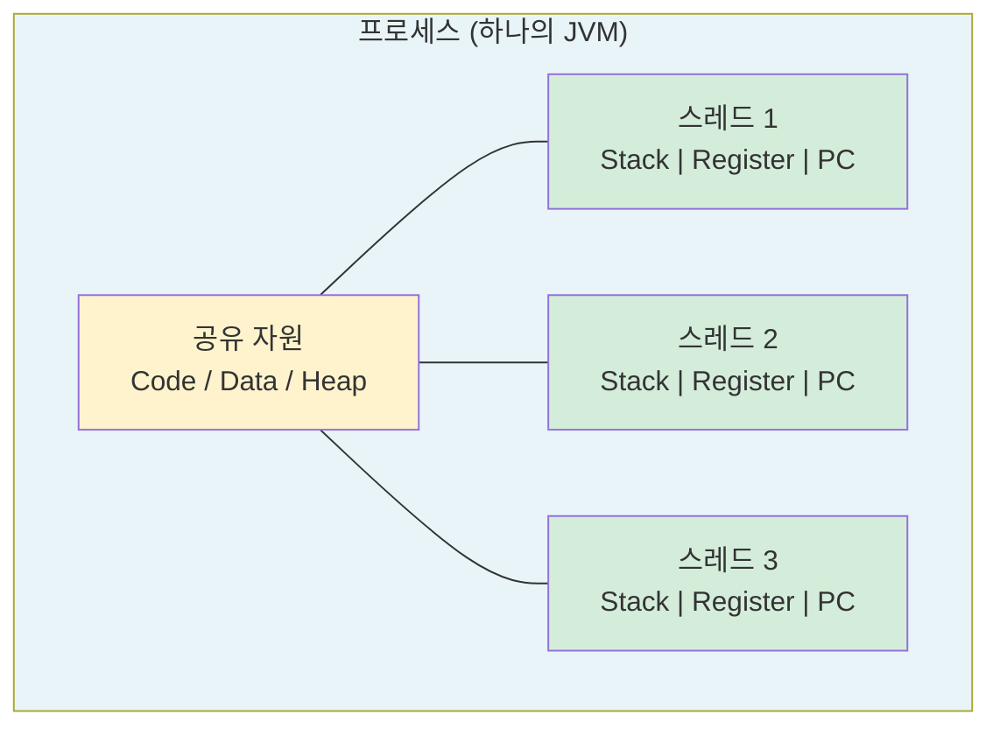

프로세스 1개 = 스레드 1개 이상. 프로세스는 스레드의 컨테이너이다.

## 2. 스레드 메모리 구조

### 공유 vs 독립 영역

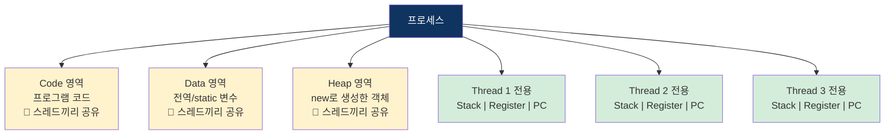

**핵심**: Code/Data/Heap은 공유, Stack만 스레드마다 별도.

### 왜 Stack만 분리하는가?

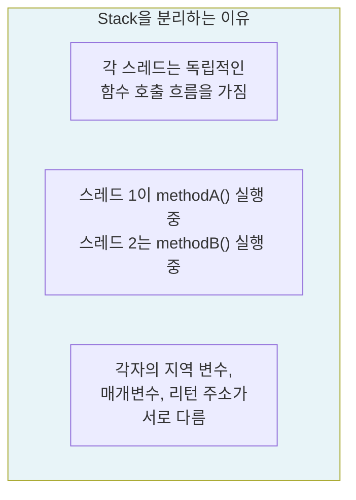

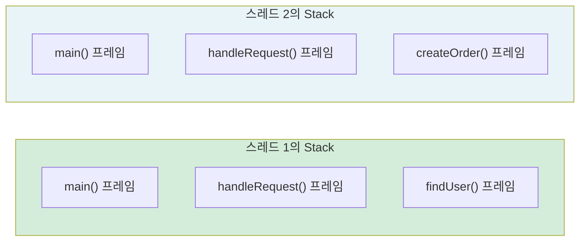

## 3. 프로세스 vs 스레드 비교

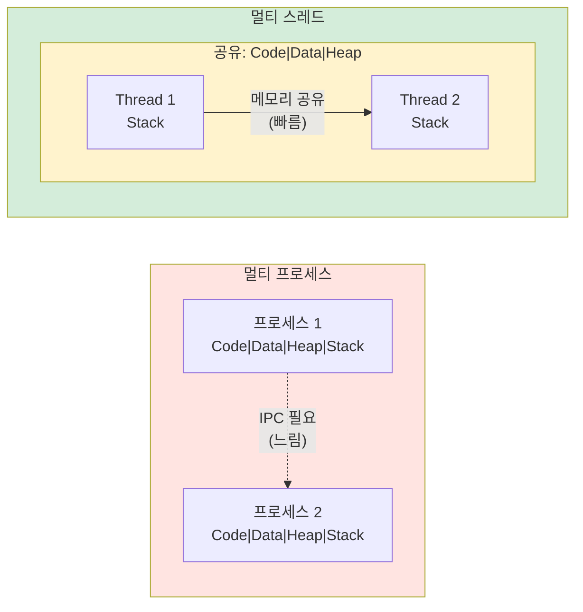

| 구분 | 프로세스 | 스레드 |
|------|---------|--------|
| 메모리 | 완전히 독립 | 공유 (Stack만 별도) |
| 생성 비용 | 크다 (메모리 전체 할당) | 작다 (Stack만 할당) |
| 통신 | IPC 필요 (복잡, 느림) | 메모리 공유 (간단, 빠름) |
| 컨텍스트 스위칭 | 느림 (메모리 재매핑 필요) | 빠름 (공유 영역 유지) |
| 안정성 | 한 프로세스 죽어도 독립 | 한 스레드 죽으면 전체 죽음 ⚠️ |
| 데이터 공유 | 어려움 | 쉬움 (단, 동시성 문제 주의) |

### 한 스레드가 죽으면?

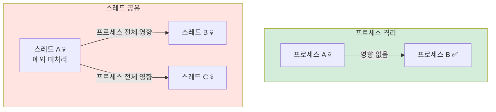

> **실무 주의**: 스프링에서 한 스레드의 예외가 처리되지 않으면 JVM 전체가 불안정해질 수 있다. 그래서 `@ExceptionHandler`, `@ControllerAdvice`가 중요한 것이다.

## 4. 동시성 문제 ⚠️

스레드는 메모리를 공유해서 편하지만, 여러 스레드가 같은 데이터를 동시에 건드리면 문제가 생긴다.

### Race Condition (경쟁 조건)

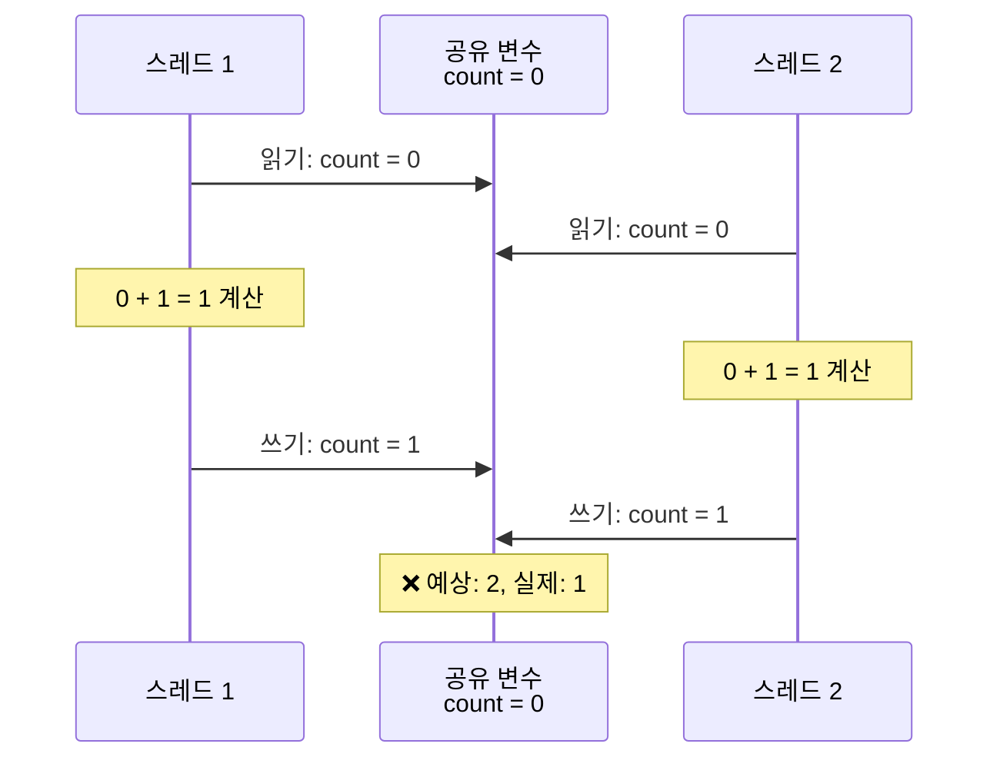

```java
int count = 0;

// Thread 1                    // Thread 2
count++;                       count++;
// 읽기(0) → 증가 → 쓰기(1)   // 읽기(0) → 증가 → 쓰기(1)

// 예상: count = 2
// 실제: count = 1 (두 스레드가 동시에 0을 읽었기 때문)
```

### 실무 예시 - 재고 오버셀링

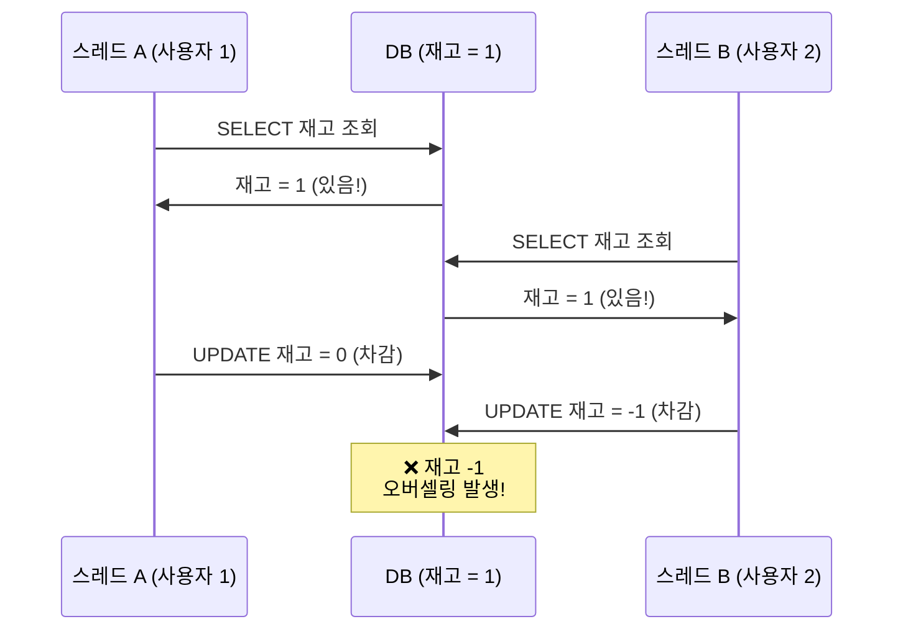

### Deadlock (교착 상태)

두 스레드가 서로가 가진 자원을 기다리며 **영원히 멈추는** 상황.

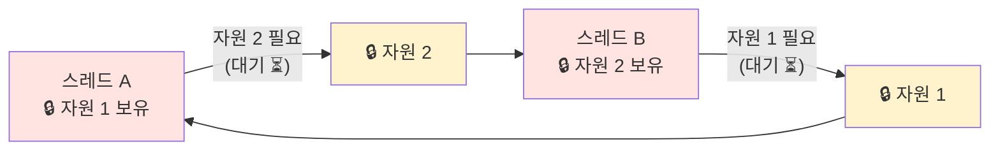

### 실무 예시 - 계좌 이체 데드락

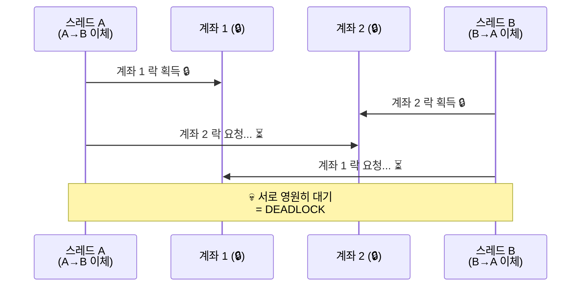

### Deadlock 발생 조건 (4가지 모두 만족 시)

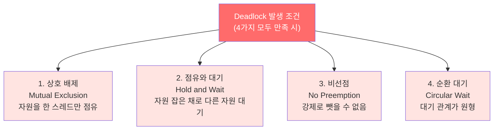

하나라도 깨면 데드락이 발생하지 않는다. 실무에서는 주로 **순환 대기를 깨는 방법**(자원 순서 고정)을 사용한다.

### Deadlock 해결 - 자원 순서 고정

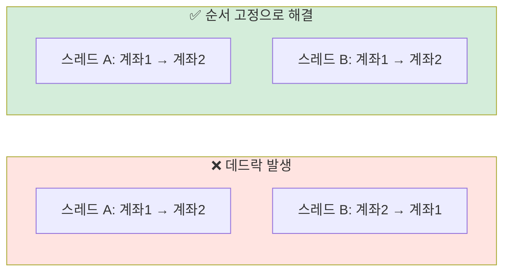

## 5. 동기화 방법

### Mutex (Mutual Exclusion)

한 번에 하나의 스레드만 접근 가능하게 하는 잠금 장치.

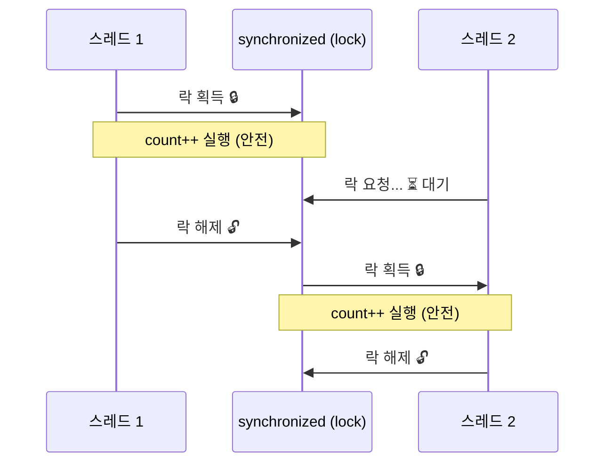

```java
// 자바에서 Mutex → synchronized 키워드
synchronized (lock) {
    count++; // 한 스레드씩 순서대로 실행
}
```

### Semaphore

N개의 스레드까지 동시 접근을 허용하는 방식.

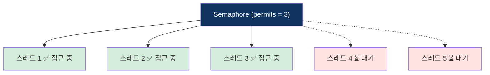

```java
Semaphore sem = new Semaphore(3); // 동시에 3개까지 허용

sem.acquire(); // 허가 획득 (permits--)
try {
    // 작업 수행
} finally {
    sem.release(); // 허가 반환 (permits++)
}
```

### Mutex vs Semaphore

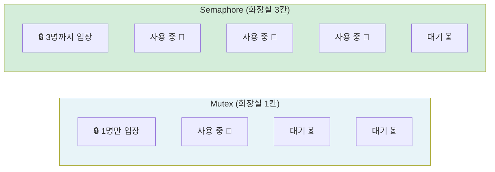

| 구분 | Mutex | Semaphore |
|------|-------|-----------|
| 동시 접근 | 1개만 | N개까지 |
| 자바 구현 | `synchronized` | `Semaphore` 클래스 |
| 비유 | 화장실 1칸 | 화장실 N칸 |
| 사용 사례 | 공유 자원 보호 | 커넥션 풀, 스레드 풀 제한 |

### Monitor

자바 객체마다 내부적으로 가진 락. `synchronized`가 이 방식을 사용한다.

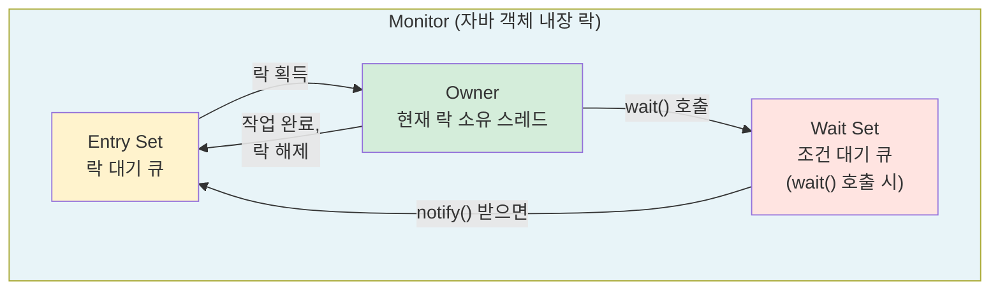

```java
synchronized (monitor) {
    while (!조건) {
        monitor.wait();    // Wait Set으로 이동
    }
    // 작업 수행
    monitor.notify();     // Wait Set의 스레드 하나를 깨움
}
```

## 6. 스레드 풀 (Thread Pool)

스레드를 매번 생성/삭제하면 비용이 크다. 미리 만들어두고 재사용하는 것이 스레드 풀이다.

### 왜 스레드 풀이 필요한가?

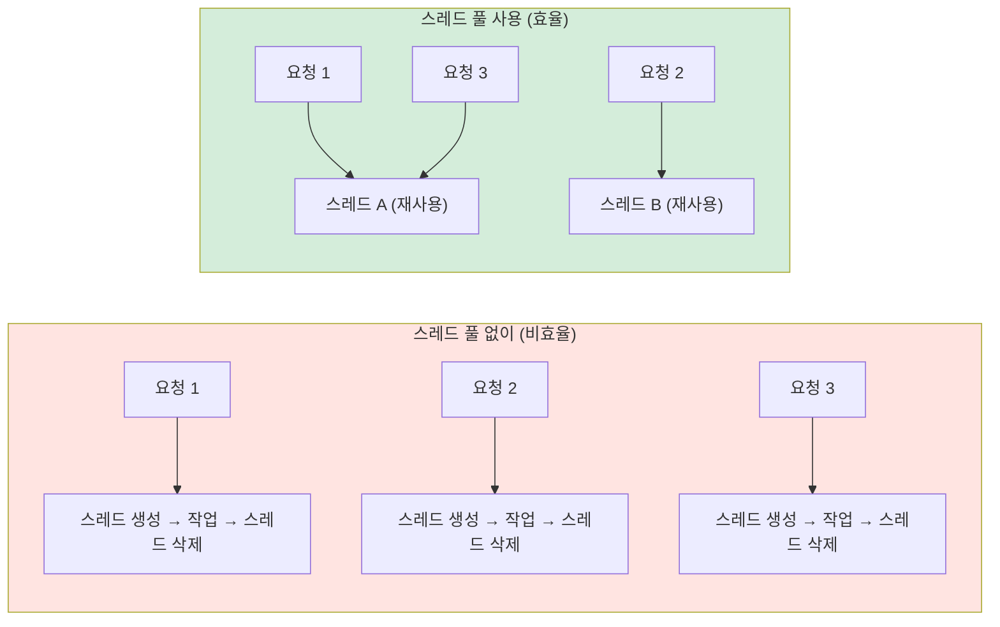

### 스레드 풀 동작 방식

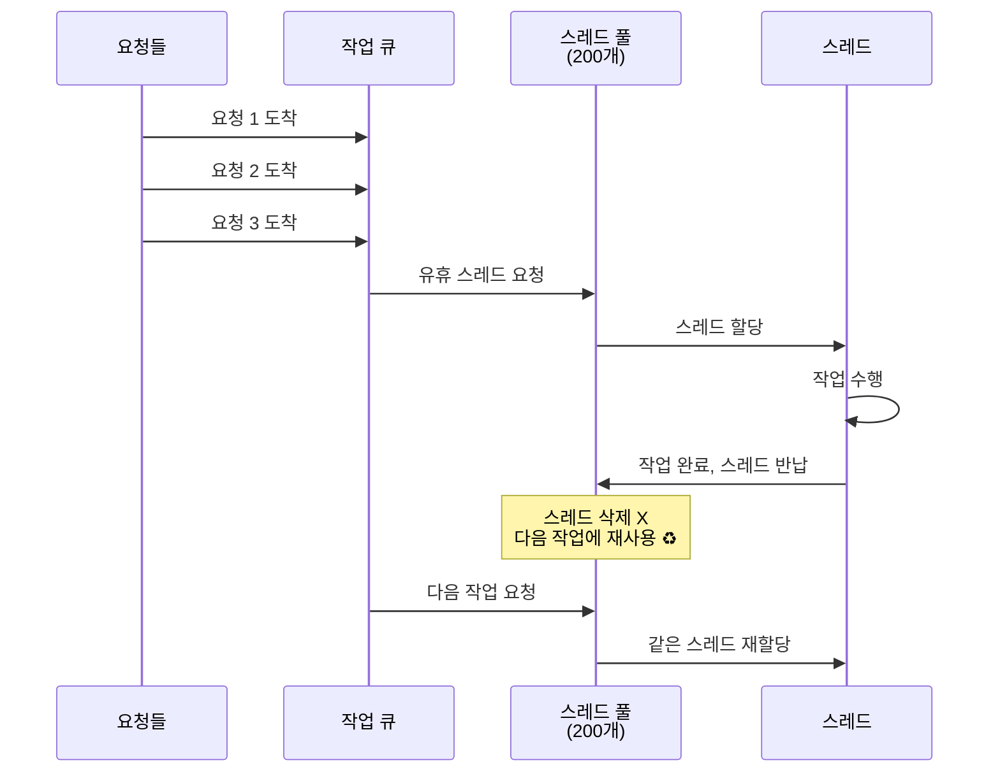

### 스레드 풀 크기와 성능

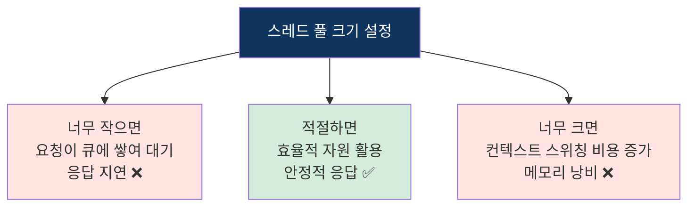

### 자바의 스레드 풀

```java
// 자바 기본 스레드 풀
ExecutorService pool = Executors.newFixedThreadPool(10);

pool.submit(() -> {
    System.out.println("작업 실행: " + Thread.currentThread().getName());
});

pool.shutdown(); // 모든 작업 완료 후 종료
```

## 7. 자바의 동시성 제어 ⭐

### synchronized vs Lock vs Atomic

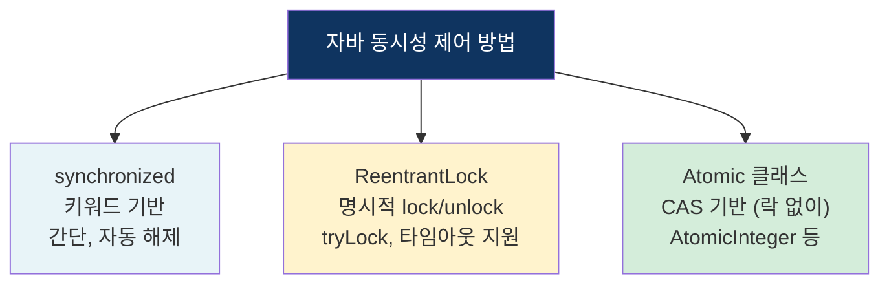

```java
// 1. synchronized
synchronized (this) {
    count++;
}

// 2. ReentrantLock
Lock lock = new ReentrantLock();
lock.lock();
try {
    count++;
} finally {
    lock.unlock(); // 반드시 해제
}

// 3. AtomicInteger (락 없이 안전)
AtomicInteger count = new AtomicInteger(0);
count.incrementAndGet(); // 원자적 증가
```

## 8. 백엔드 개발자 관점 연결

### 스프링 부트 요청 처리 = 스레드 풀 활용

```mermaid
sequenceDiagram
    participant Client as 클라이언트
    participant Tomcat as 톰캣 스레드 풀<br/>(기본 200개)
    participant Thread as 할당된 스레드
    participant Controller as Controller
    participant Service as Service
    participant DB as DB

    Client->>Tomcat: HTTP 요청
    Tomcat->>Thread: 유휴 스레드 할당
    Thread->>Controller: @GetMapping 실행
    Controller->>Service: @Service 메서드 호출
    Service->>DB: JPA findById() (I/O 대기)
    Note over Thread: ⏳ DB 응답 대기<br/>스레드 블로킹 상태
    DB->>Service: 결과 반환
    Service->>Controller: 응답 DTO 반환
    Controller->>Thread: ResponseEntity 반환
    Thread->>Tomcat: 스레드 반납 ♻️
    Tomcat->>Client: HTTP 응답 전송
```

### 톰캣 스레드 풀 설정

```yaml
# application.yml
server:
  tomcat:
    threads:
      max: 200        # 최대 스레드 수
      min-spare: 10   # 최소 유지 스레드 수
    max-connections: 8192
    accept-count: 100  # 대기 큐 크기
```

```mermaid
graph TB
    REQ["요청 도착"]
    REQ --> CHECK1{스레드<br/>풀에 여유?}
    CHECK1 -->|있음| ASSIGN["스레드 할당<br/>즉시 처리 ⚡"]
    CHECK1 -->|없음| CHECK2{대기 큐에<br/>여유?}
    CHECK2 -->|있음| QUEUE["대기 큐에 저장<br/>순서 대기 ⏳"]
    CHECK2 -->|없음| REJECT["❌ 503 에러<br/>요청 거부"]

    style ASSIGN fill:#d4edda
    style QUEUE fill:#fff3cd
    style REJECT fill:#ff6b6b,color:#fff
```

### @Transactional과 동시성 문제

```java
@Transactional
public void deductStock(Long productId) {
    Product p = repository.findById(productId);
    p.decreaseStock(1); // 재고 차감
    repository.save(p);
}
// ⚠️ 여러 스레드가 동시 호출하면 Race Condition!
```

### 해결 - DB 락 종류

```mermaid
graph TB
    LOCK["DB 락으로 동시성 해결"]
    LOCK --> OPT["낙관적 락<br/>Optimistic Lock"]
    LOCK --> PES["비관적 락<br/>Pessimistic Lock"]

    OPT --> OPT_D["버전 번호로 충돌 감지<br/>충돌 시 재시도<br/>@Version 사용"]
    PES --> PES_D["SELECT FOR UPDATE<br/>읽을 때부터 잠금<br/>충돌 원천 차단"]

    style LOCK fill:#0f3460,color:#fff
    style OPT fill:#d4edda
    style PES fill:#e8f4f8
```

```mermaid
sequenceDiagram
    participant T1 as 스레드 A
    participant DB as DB
    participant T2 as 스레드 B

    Note over T1,T2: 비관적 락 (Pessimistic Lock)
    T1->>DB: SELECT ... FOR UPDATE 🔒
    Note over DB: 해당 행 잠금
    T2->>DB: SELECT ... FOR UPDATE
    Note over T2: ⏳ 대기 (락 해제까지)
    T1->>DB: UPDATE 재고 = 0
    T1->>DB: COMMIT → 🔓 락 해제
    DB->>T2: 락 획득 🔒
    T2->>DB: SELECT → 재고 = 0
    Note over T2: 재고 없음 → 차감 안 함
    T2->>DB: COMMIT → 🔓 락 해제
    Note over DB: ✅ 오버셀링 방지!
```

```mermaid
sequenceDiagram
    participant T1 as 스레드 A
    participant DB as DB (version=1)
    participant T2 as 스레드 B

    Note over T1,T2: 낙관적 락 (Optimistic Lock)
    T1->>DB: SELECT (재고=1, version=1)
    T2->>DB: SELECT (재고=1, version=1)
    T1->>DB: UPDATE SET 재고=0, version=2<br/>WHERE version=1
    Note over DB: ✅ 성공 (version 1→2)
    T2->>DB: UPDATE SET 재고=0, version=2<br/>WHERE version=1
    Note over DB: ❌ 실패! version이 이미 2<br/>OptimisticLockException
    Note over T2: 재시도 또는 실패 처리
```

| 방식 | 구현 | 적합한 상황 |
|------|------|-----------|
| 비관적 락 | `@Lock(PESSIMISTIC_WRITE)` | 충돌 많은 경우 (재고 차감) |
| 낙관적 락 | `@Version` 필드 | 충돌 적은 경우 (게시글 수정) |

### 스프링의 스레드 안전한 설계

```mermaid
graph TB
    subgraph 안전["스프링 빈 = 싱글톤 + Stateless ✅"]
        BEAN["@Service UserService<br/>(인스턴스 1개)"]
        T1A["스레드 1"] --> BEAN
        T2A["스레드 2"] --> BEAN
        T3A["스레드 3"] --> BEAN
        Note1["상태(필드)를 가지지 않으면<br/>동시 접근해도 안전"]
    end

    subgraph 위험["Stateful 빈 ❌"]
        BEAN2["@Service 에 필드 변수<br/>int count = 0"]
        WARN["⚠️ 여러 스레드가<br/>같은 필드 수정 → Race Condition"]
    end

    style 안전 fill:#d4edda
    style 위험 fill:#ffe4e1
```

```java
// ✅ 안전 - Stateless (필드에 상태 없음)
@Service
public class UserService {
    private final UserRepository userRepository; // 주입받은 의존성만

    public User findUser(Long id) {
        return userRepository.findById(id); // 지역 변수만 사용
    }
}

// ❌ 위험 - Stateful (필드에 상태 있음)
@Service
public class CounterService {
    private int count = 0; // 공유 상태! → Race Condition 위험

    public void increment() {
        count++; // 여러 스레드가 동시에 접근 가능
    }
}
```

## 핵심 요약

| 개념 | 핵심 내용 | 백엔드 연결 |
|------|----------|------------|
| 스레드 | 프로세스 안의 실행 흐름 | 톰캣이 요청마다 스레드 할당 |
| 메모리 공유 | Heap 공유, Stack 독립 | Stateless 설계가 중요한 이유 |
| Race Condition | 동시 접근 → 데이터 불일치 | 재고 오버셀링, 좋아요 카운트 |
| Deadlock | 서로 락 대기 → 영원히 멈춤 | DB 트랜잭션 교착, 자원 순서 고정 |
| 동기화 | Mutex, Semaphore, Monitor | synchronized, @Lock |
| 스레드 풀 | 미리 생성 & 재사용 | 톰캣 기본 200개, 커넥션 풀 |
| DB 락 | 낙관적/비관적 락 | @Version, @Lock(PESSIMISTIC_WRITE) |
